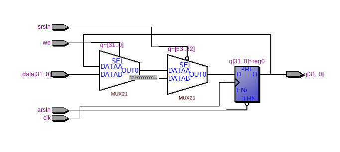
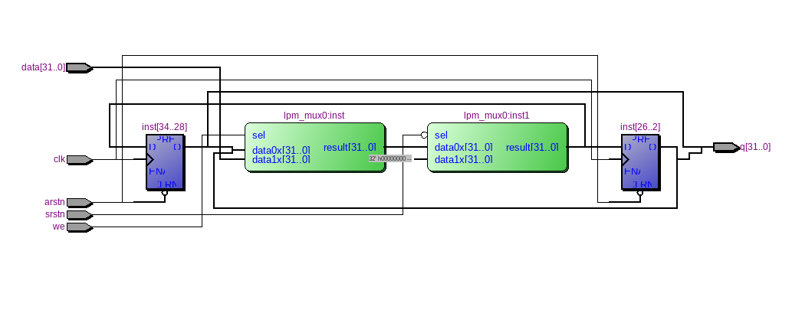

=============================================
Лабораторна робота №1
=============================================

Тема
------

Налаштування середовища розробки (Linux, Quartus, Incisive), тестовий проект

Хід роботи
-----------

**Налаштування середовища.** Для того щоб виконати дані нам завдання з лабораторної роботи було поставлено на ПК VirtualBox та встановили в дану віртуальну коробку Linux Manjaro версія 18.00 
(це спричинено тим що мій ПК не підтримує версію 18.04) потім в самій системі Linux Manjaro для роботи було встановлено Quartus 13 SP1 та Cadence Incisive 15.10. За допомогою Quartus 13 SP1 ми можемо програмувати під ПЛІС.
Cadence Incisive 15.20 программа в якій ми можемо робити симуляцію побудованих схем.

**Створення тестового проекту.**  Основне завдання завдання
було створити 32-розрядний регістр з асинхронним, синхронним скиданнями та входом дозволу у форматі bdf. Я створив проект, який вміщував в собі два
мультиплексори з бібліотеки мегафункцій та сконфігурувавши його через MegaWizard та 32 D-тригери. Потім я скомпілював проект та експортував його в Verilog файл
та написав простий код, що тестував можливості запису у регістр в симулятор Cadence Incisive, його синхронного та асинхронного скидання. Після цього я відкрив директорію
проекту у ``nclaunch``та запустив Cadence Incisive 15.20 в якій ми симулювали розроблену схему.
Після черги невдач та допомоги Матюшi Олега вдалося запустити симуляцію та перевірити правильність роботи схеми.
Також слід зазначити, що код на Verilog та звiт був частково запозичений у Коцюбайло Антона. 
Потім я написав реалізацію регістру на Verilog зкомпілював та реалізував RTL схему регістру.

RTL схема реалізованого на Verilog

RTL схема регістру виконаного в схемному редакторі

Висновки
---------

В даній лабораторній роботі ми побудували 32 бітний регістр, опанували основами роботи в системі Linux Manjaro та навчилися користуватися такими середовищами як
Quartus 13 SP1 та Cadence Incisive 15.20. Було також вивчені основи мови опису Verilog. Але слід зазначити, що в Verilog реалізовувати такі задачі, як регістр набагато проще ніж малювати все в схематиці. В схематиці все
креслити дуже довго, а в Verilog просто реалізується.

