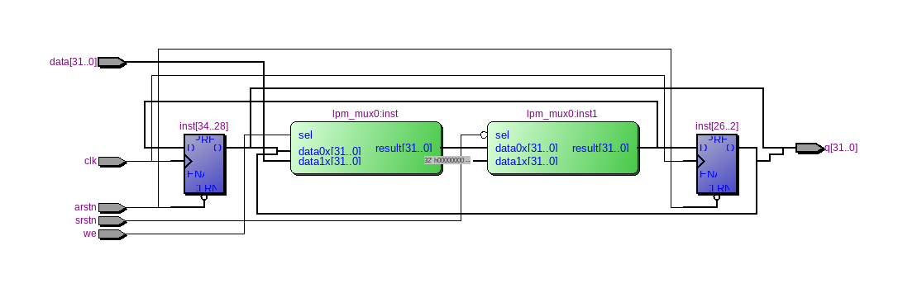
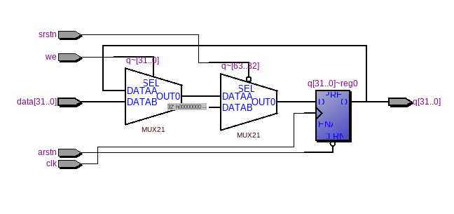

=============================================
Лабораторна робота №1
=============================================

Тема:
_____

Налаштування серодовища розробки

Хід роботи:
__________

Для початку роботи було встановлено дистрибутив ``manjaro`` версії ``17.0.5``, середовище розробки ``Quartus II`` версія ``13 SP1``, та HDL симулятор ``Cadence Incisive``.
Згідно завданню було переглянуто в RTL Viewer 32-розрядний "flip-flop" регістр з асинхронним скиданням. Його вигляд можна побачити на Рис.1.1. Крім того було дослідженно його
``waveform`` в симуляторі.
Для реалізації поставленого завдання, було прийнято рішення використати однорозрядний регістр. (Опис якого знаходиться в дерективі ``src`` під назвою ``register.v``)
Було створено його умовне графічне позначення та розмножено до 32 штук. За допомогою інстументів середовища ``Quartus`` було зєднано ці регістри. Для реалізації синхронного скидання
використовувався мультиплексор. Дана схема була просимульована в HDL симуляторі, який вказаний вище. ``waveform`` цих регістрів були однакові, за виключенням додаткового скидання в одному із них.

Рисунок 1.1 - RTL схема 32-розрядного регістра у схемному редакторi

Рисунок 1.2 - RTL схема 32-розрядного регістра на Verilog

Висновок:
-------

В ході виконання лабароторної роботи було досліджено 32-розрядний "flip-flop" регістр з різними типами скидання. Після дослідженнь ``waveform`` обох регістрів, було зроблено висновок,
що функціональні можливості в них однакові. Єдина різниця полягає в апаратній реалізації. зі збільшеням с кладності проектів складність створення схеми та її відладки також
 дуже сильно зростає, тоді на допомогу приходить Verilog. За допомогою якого складні схеми можна зробити набагато компактніше, ніж у редакторі схем. Тому для кожгного розміру 
проекта краще використовувати різні методи його створення.

P.S. Структра звіту була підглянута у студента групи ДК71 Лаврусенко олександра

