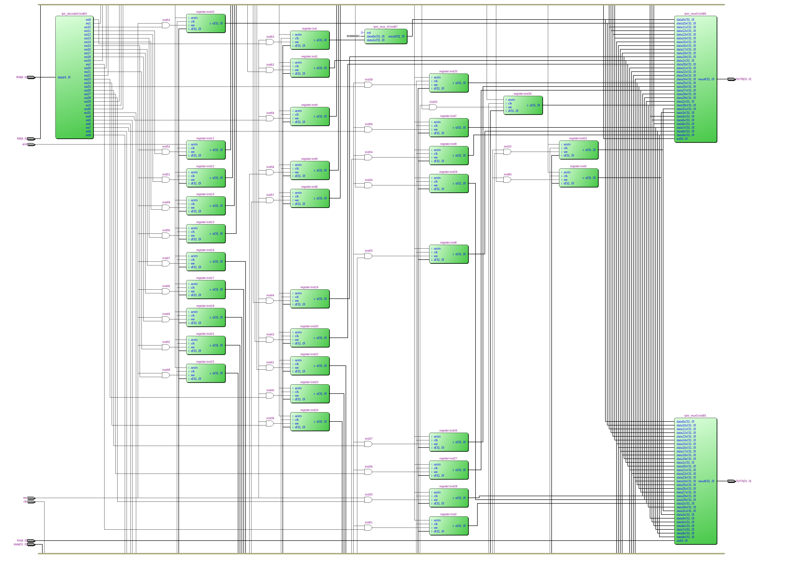
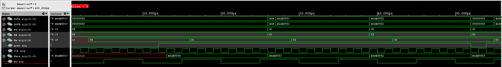

======================
Лабараторна робота №2
======================

Тема:
--------

Створення "Регістрового файлу"

Завдання:
---------

Створити 32-бітовий "Регістровий файл", який буде містити:

2 - 32-бітних порта считування з регістрів

1 - 32-бітний порт запису в регістр

1 - порт вибору регістру для запису

2 - порта вибору регістру для зчитування

асинхронне скидання 

сигнал ``we``

Хід роботи:
-----------

Регістровий файл — пристрій процесора, що включає в себе регістри і використовується для збереження і швидкого доступу до цифрової інформації.[1]

"Регістровий файл" може одночасно зчитувати значення двох регістрів та записувати в один регістр нову інфрмацію, крім того використовується тільки 31 регістр (така особливість ``MIPS`` ядра).
``R0`` підключений до мультиплексора, який завжди видає "нулі".

Структурна схема "регістровго файлу" була взята з даного `джерела <https://drive.google.com/drive/folders/17GUVfdv4khRPolRkopDLgYgJJ-amIf6t>`__.
Для початку було описано 32-розрядний "flip-flop" регістр з асинхронним скиданням на мові Verilog (``src/register.v``). Цей файл був успішно скомпільований, та перевірений в HDL симуляторі ``Cadence Incisive``.
Після цього в схемному редакторі ``Quartus`` було реалізовано "Регістровий файл". Для тестування було створено Verilog файл проекту та ``test bench`` до нього.
На Рис.2.1 показано схему в ``RTL Viewer``, а на Рис 2.1 показано результат симуляції.

Рисунок 2.1 - Вигляд "регістровго файлу" в ``RTL Viewer``

Рисунок 2.2 - Сигнали в середовищі ``Cadence Incisive``

Висновок:
---------

Вході виконання лабараторної роботи було синтезовано та перевірено "регістровий файл", який включає в себе 2 32-розрядких порта виводу інформації, вхід ``we``, асинхронне скидання ``arst``, 1 адресна шина для вибуру регістру в який буде записано інформацію(``RW``), 
2 шини для вибору считувальних регістрів (``RA``, ``RB``).

Було засвоєно основне призначення "регістровго файлу".
``waveform`` синтезованого "регістрового файлу" відповідає очікуванням.

Список використаних джерел:
--------------------------

1. Регістровий файл [Електронний ресурс] Режим доступу: <https://ru.wikipedia.org/wiki/%D0%A0%D0%B5%D0%B3%D0%B8%D1%81%D1%82%D1%80%D0%BE%D0%B2%D1%8B%D0%B9_%D1%84%D0%B0%D0%B9%D0%BB>