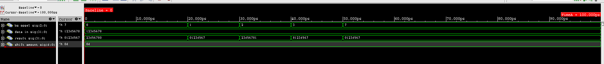

======================
Лабараторна робота №3
======================

Тема:
--------

Створення "Здвигового регістру"

Завдання:
---------

Створити  "Здвигового регістру", який буде вміти :

SLL (shift left logical)

SRL (shift right logical)

ROL (rotate left)

ROR (rotate right)

SRA (shift right arithmetical)

Робити опирацію здвигу за один такт синхро сигналу

Хід роботи:
-----------

Barrel shifter (пристрій швидкого зсуву) — цифрова електронна схема, яка виконує зсув даних на вказане число позицій за один такт синхронізації. Пристрій швидкого зсуву також може виконувати циклічний зсув і розширення знакового біта.[1]

Для реалізації даного пристрою було принято використати мову опису апаратури Verilog. Вихідний файл: ``src/lab3_barrel_shifter.v``. Для керування "Barrel Sgifter" було реалізовано 2 сигнала: ``shift_amout``, ``bs_opsel``. 

Де за кількісь біт здвигу відповідає сигнал ``shift_amout``, а вибору типу звигу відповідає ``bs_opsel``. На рисунку 3.1 показано його вигляд в ``RTL Viewer``, а вейформу показно на рисунку 3.2. Дану реалізацію було перевірено Волинко Назаром.

.. image:: media/lab3_barrel_shifter.png

Рисунок 3.1 - Вигляд "Здвигового регістру"" в ``RTL Viewer``

Рисунок 3.2 - Сигнали в середовищі ``Cadence Incisive``

Висновок:
---------

В ході виконання лабароторної роботи було реалізовано "регістр швидкого звдигу". Який повністю відповідає поставленому завданню, а саме: він виконує операцію сдвигу за один тактовий імпульс, виконує всі здвиги, які є в завданні. Дані твердження були перевірені в симуляторі, вейформа якого прикладена до PR.

Даний блок буде використовуватись в АЛП, тому реалізація "Barrel Shifter" є максимально оптимальна, враховуючи набуті знання. Також було засвоєно нові констукції на мові Verilog, які можуть допомогти нам в майбутніх проектах.

Список використаних джерел:
--------------------------

1. Barrel Shifter [Електронний ресурс] Режим доступу: <https://uk.wikipedia.org/wiki/Barrel_shifter>

P.S. Код було взято у Вадима Харчука