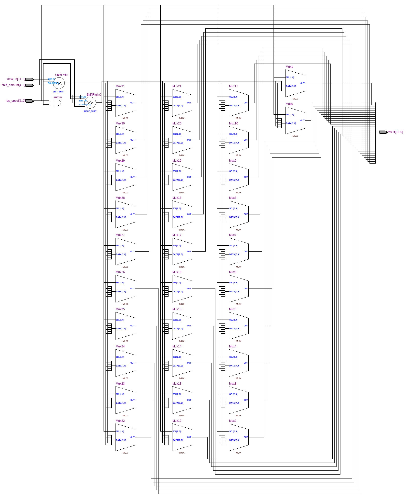
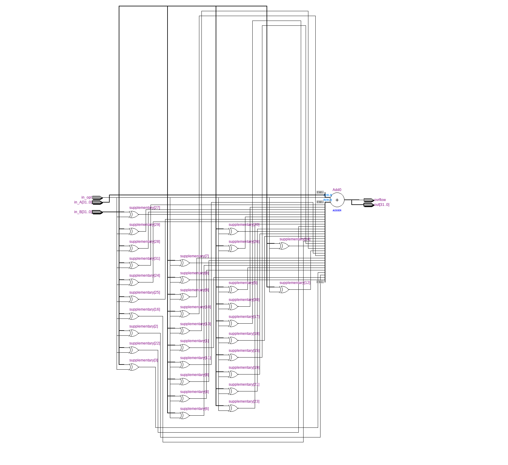
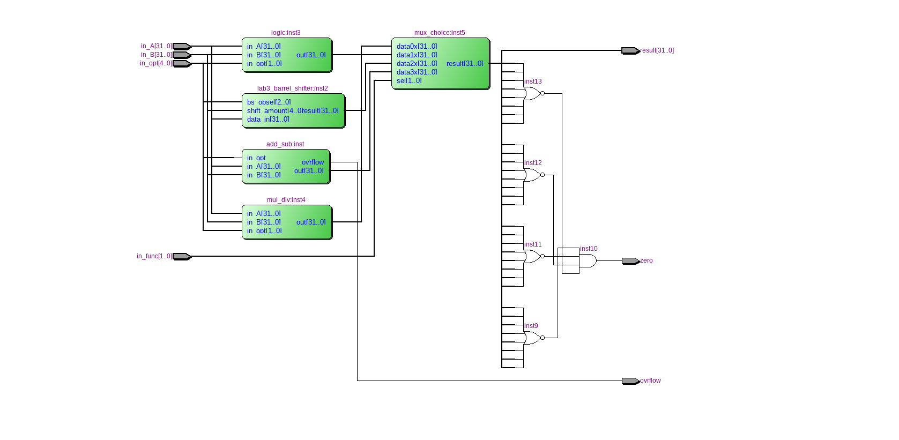
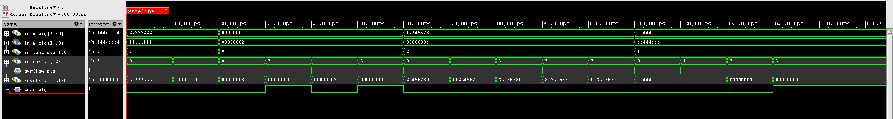

======================
Лабараторна робота №4
======================

Тема:
--------

Створення "Арифметико-логічного пристрою"

Завдання:
---------

Створити  "Арифметико-логічногий пристрій", який буде вміти :

Арефметичний/логічний зсув (використано "Barrel shifter із Лабараторної роботи №3")

Сумувати знакові та беззнакові числа

Цілочисельне множення/ділення

Побітові операції AND, OR, NOR, XOR

Реалізувати прапорці zero, overflow

Хід роботи:
-----------

Для даної лабароторної роботи було реалізовано блок універсального суматора/віднімача (``src/add_sub.v``), який був реалізовано на мові ``Verilog``. Крім того даний суматор має сигнал ``overflow``, який сигналізує про вихід за допустимий діапазон результату арифметичних операцій над знаковими операндами.[1]

Логічний блок включає в себе елементи ``AND``, ``OR``, ``NOR``, ``XOR``, ``Verilog`` файл: ``src/logic.v``. Блок множення/ділення також реалізвонаий на мові опису цифрової апаратури (``src/mul_div.v``), він має вхід ``in_opt``, який вибирає яку дію виконувати. 

На виході АЛП ми можемо побачити мультиплексор, який був створений за допомогою мегафункції, він приймає на свій адресний вхід сигнал ``in_func``, який вибирає яка дія буде вивеедена на виході ``OUTPUT`` АЛП.

Нижче буде представлено RTL моделі всіх блоків АЛП.

Рисунок 4.1 - Вигляд "Здвигового регістру"" в ``RTL Viewer``

Рисунок 4.2 - Вигляд "Cуматора" в ``RTL Viewer``

.. image:: media/logic.png

Рисунок 4.3 - Вигляд "Логічного блока" в ``RTL Viewer``

.. image:: media/mul_div.png

Рисунок 4.4 - Вигляд "Перемножувача/Дільника" в ``RTL Viewer``

Рисунок 4.5 - Вигляд "АЛП" в ``RTL Viewer``

Рисунок 4.6 - Вигляд "Waveform" АЛП

Висновок:
---------

В ході виконання лабароторної роботи було реалізовано "АЛП". Який повністю відповідає поставленому завданню, а саме: він виконує операцію сдвигу за один тактовий імпульс, виконує всі здвиги, які є в завданні. Тажож він додає та віднімає знакові та беззнакові числа, ділить, множить, виконує логічні операції. Також було написано ``test bench``.

В даній лабароторній роботі було повністю засвоєно прицип роботи та АЛП, для керування ним потрібен блок та память програм. Для перевірки було використано середовище ``Cadence Incisive``, "вейформа" роботи АЛП прикріплена до PR, пристрій працює коректно. 

Список використаних джерел:
--------------------------

1. Overflow [Електронний ресурс] Режим доступу: <https://en.wikipedia.org/wiki/Overflow_flag>

P.S. Частина коду було взято у Вадима Харчука