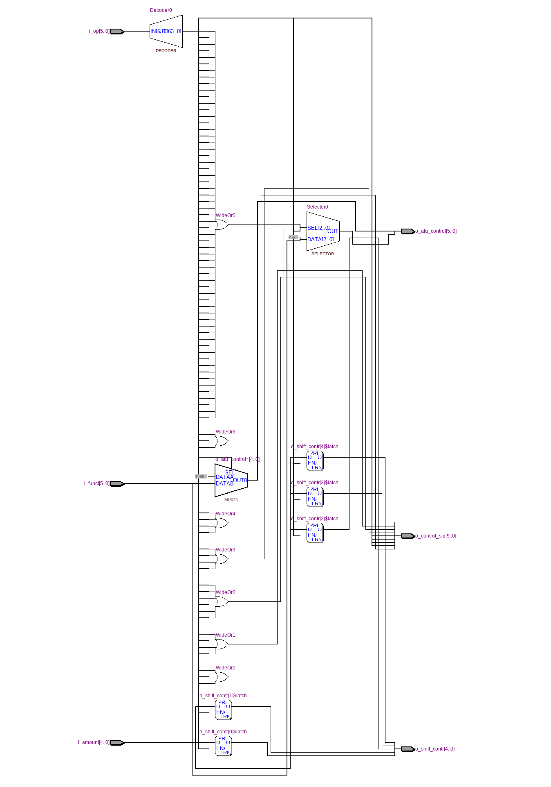
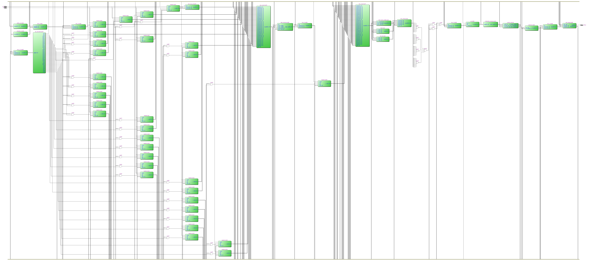
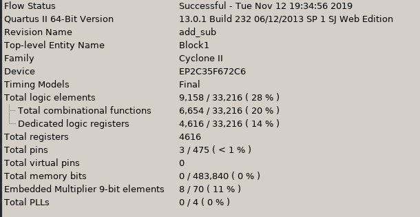
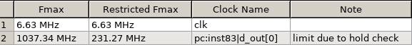
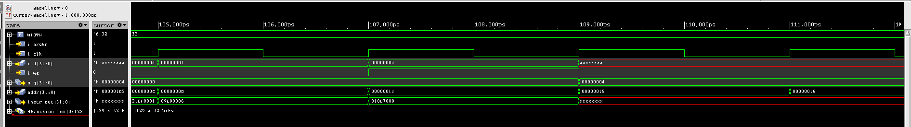

======================
Лабараторна робота №5-6
======================

Тема:
--------

Створення  власного "MIPS-Ядра"

Завдання:
---------

Створити  власние "MIPS-ядро", яке буде виконувати інструкції :

Load Word (LW) , ADD, SUB, MUL, ADD_I, SUB_I, Store Word(SW), BEQ, BNE, J.

Також порібно записати в ```data memory``` масив, знайти найбільший, найменший елемент та перемножити їх.


Хід роботи:
-----------

По перше для свторення "ядра" потрібно реалізувати блоки ```data memory``` та ```instuction memory```. Пам'ять програм повинна бути асинхронна, а пам'ять даних синхронна. Машинний код 
було замисано за допомогою функції ```$readmemb```, пам'ять даних була записана аналогічним способом. Також було реалізовано ```program counter```, що по суті є просто регістром, який зберігає адресу наступної команди. Перша відмінність від "орігінального MIPSa" - перші два молодші біти не "нулі". 
Для одночасної роботи системи портібно реалізувати присстрій, який буде керувати всім процесом. ```control_unit``` виконує цю задачу. Друга віднмінність від "орігіналу", ```control_unit``` керує не тільки керуючими сигналами, а й АЛУ.
Нижче буде представлено вигляд всіх логічних блоків.



Рисунок 6.1 - Вигляд "control_unit"" в ``RTL Viewer``



Рисунок 6.2 - Вигляд "MIPS-ядра" в ``RTL Viewer``



Рисунок 6.3 - Використані ресурси плати



Рисунок 6.4 - Максимальна частота схеми



Рисунок 6.5 - "Вейформа" регістру з результатом


Висновок:
---------

В ході виконання лабараторної роботи було створене власне "MIPS-ядро", яке виконує всі инструкції, які були поставлені. Максимальна частота сягає 6.3 МГЦ. Її можливо збільшити, оптимізувавши схему, або зробити його "конвеєним". Крім цього було написано програмний код, який був переведений в машинний код, що міститься в пам'яті програм.

P.S. Частина коду була взята у Вадима Харчука та Олександра Шліхти