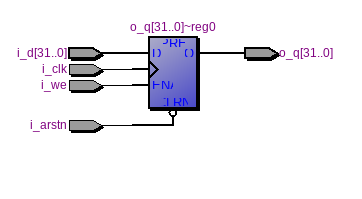
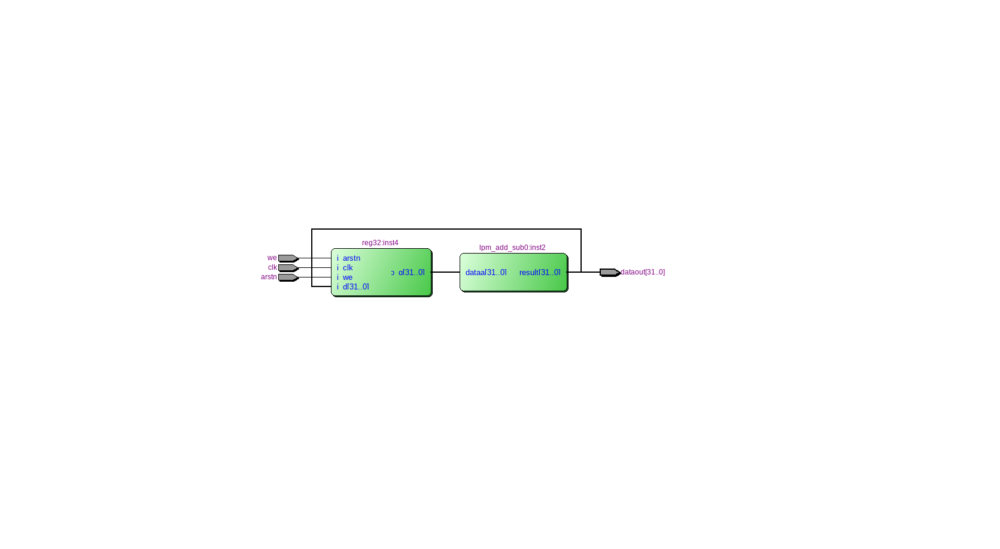
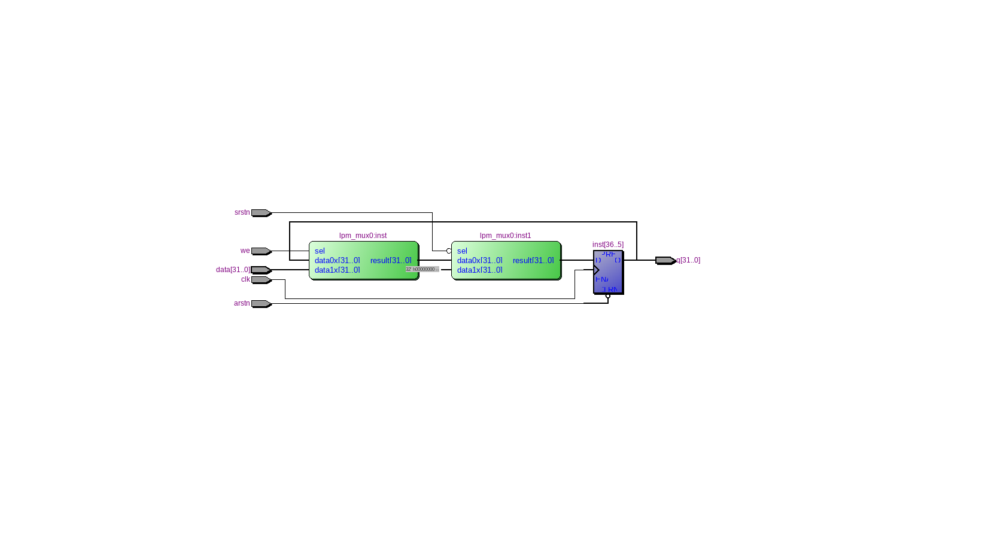

=============================================
Лабораторна робота №1
=============================================

Тема
------

Налаштування середовищ розробки: Linux, Quartus, Incisive. Створення тестових проектів

Хід роботи
-------

**Налаштування середовища.**  Метою лабораторної роботи будо встановлення Linux оточення, та програм Quartus 13 і Cadence Incisive 15.10. Спершу мною будо встановлено дистрибутив Linux Manjaro, виявилося, що в наш час цей процес став не складніший за процес встановлення windows, тому проблем це не створило.
Далі по відео інструкції було встановлено весь софт та перевірено його працездатність та ліцензії.

**Створення тестового проекту.**  Було повторено і перевірино схеми подані в відео інструкції. Всі схеми працюють коректно.
Для першої лабораторної роботи потрібно було створити 32-розрядний регістр з асинхронним, синхронним скиданнями. Завдяки знанням, набутим на курсі ФЛП, було створено схему у форматі ``bdf``, з використанням мультиплексорів сконфігурованих через MegaWizard.

RTL схема 32-розрядного регістру з асинхронним скиданням, створена за відео інструкцією

RTL схема завдання з відео 

RTL схема 32-розрядного регістра створена з використанням мегафункції

Далі схему було конвертовано в Verilog формат та створено його шаблон. Після цього відповідний файл було просимульовано, отримана RTL схема ідентична до створенної раніше.

Висновки	
-------

Отже, в результаті виконання лабораторної роботи ми отримали схему 32-бітного регістру створену двома способами. Явно видно, що створення громістких схем на Verilog є значно швидкішим та зручнішим, ніж за допомогою графічного редактора.

.. Шаблон для цього протоколу був взятий у студента групи ДК-72, Олега Матюши.
