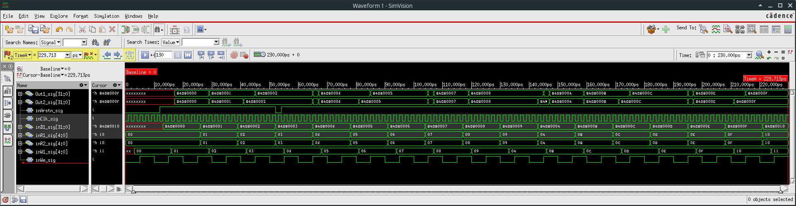

=============================================
Лабораторна робота №2
=============================================

Тема
------

Створення регістрового файлу ядра MIPS

Хід роботи
-------

**Специфікація.** Завданням поставлено створення регістрового файлу з розрядністю регістрів - 32 біти, кількістю регістрів - 32, входом асинхронного скидання та дозволу запису і входом адреси запису та данних.

**Створення проекту.** Для створення регістрового файла ядра MIPS було вирішено використовувати метод написання коду Verilog, оскільки, як ми дізналися раніше, це набагато швидше та ефективніше.
Тому використовуючи напрацювання колег було реалізовано проект регістрового файла на мові Verilog та створено test bench для нього.
Було створено 32х регістровий файл в якому є можливіть считувати вміст одночасно з двох регістрів та за допомогою декодера по черзі записувати дані в кожен з регістрів.
Також присутній вхід асинхронного скидання.

.. image:: media/register.png
RTL Схема регістрового файлу

вигляд waveform симуляції

Висновки	
-------

В результаті виконання лабораторної роботи було створено та перевірино регістровий файл з 32 регістрами розрядністю 32 біти. Написано тест бенч для зручності перевірки регістрового файлу.
Оскільки програма написана на мові Verilog, було поліпшино знання по ньому. Даний проект було створено за допомогою напрацювань студента групи ДК-72 Харчука Вадима.
