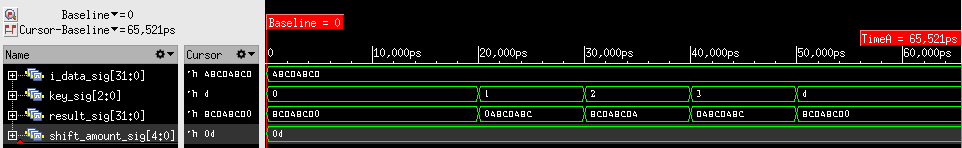

=============================================
Лабораторна робота №3
=============================================

Тема
------

Створення схеми "Barrel Shifter"

Хід роботи
-------

**Специфікація.** 
  * SLL (shift left logical)
  * SRL (shift right logical)
  * SRA (shift right arithmetical)
  * ROL (rotate left)
  * ROR (rotate right)

**Створення проекту.** Даний проект являє собою реалізацію пристрою Barrel shifter. Пристрій може виконувати вказану кількість операцій зсуву вліво та вправо,
відповідно ділення та множення на 2. Також можливий арифметичний зсув вправо та циклічні зсуви. Крім вхідного сигналу даних, наш Barrel shifter має вхідний сигнал відповідальний за вибір операції та кількість біт здвигу. 
Пристрій реалізований за допомогою мови Verilog. Щоб мати змогу обирати тип зсуву було використано конструкцію casez. Для перевірки пристрою було використано тест, в якому всі операції послідовно виконуються 
з приходом нового такту. Тест було взято з напрацювань Волинко Назара та Харчука Вадима.

.. image:: media/barrel_shifter.png
RTL Схема Barrel shifter

вигляд waveform симуляції

Висновки	
-------
В результаті виконання лабораторної роботи було створено пристрій швидкого зсуву. Реалізовано побітові зсуви вліво та вправо, 
арифметичний зсув вправо та циклічні зсуви. Провівши тести, підтвердили його коректну працездатність. В процесі створення проекту було вивчено 
конструкцію casez та $signed мови Verilog. Забігаючи наперед, можна відмітити те, що даний Barrel shifter буде потрібен в майбутньому для створення ALU блоку.
Проект було створено завдяки напрацюванням Харчука Вадима.
.. Вадим, з Днем Народження!!!!
