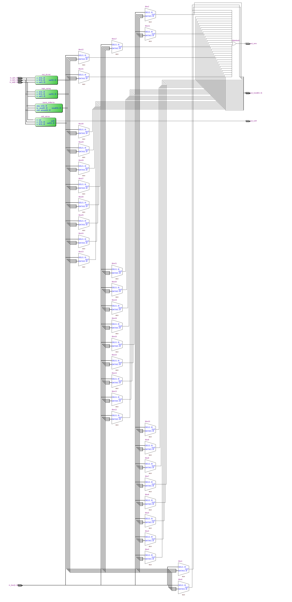
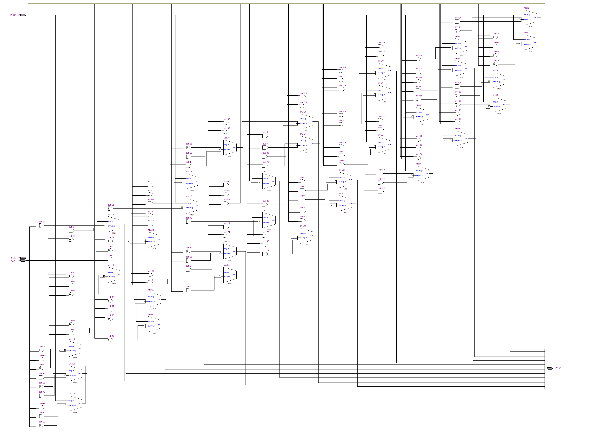
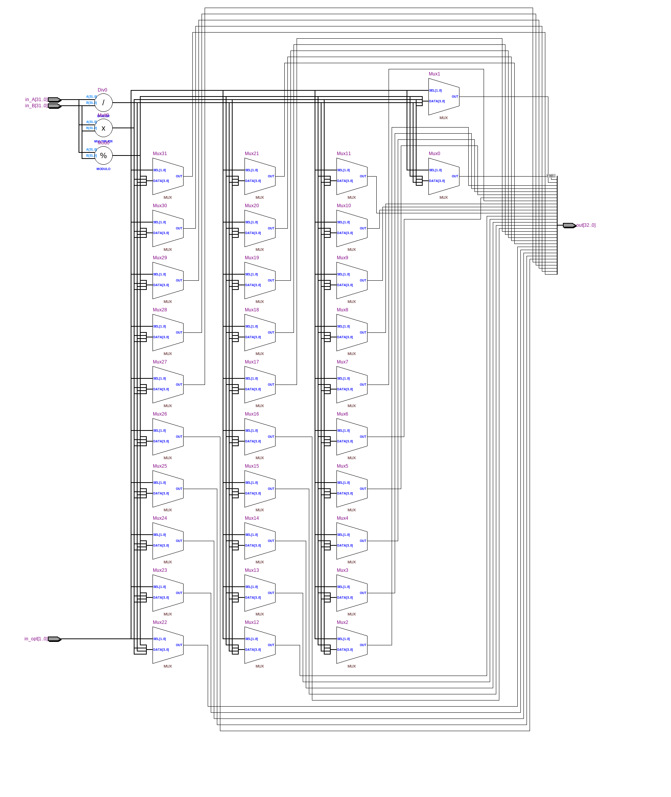
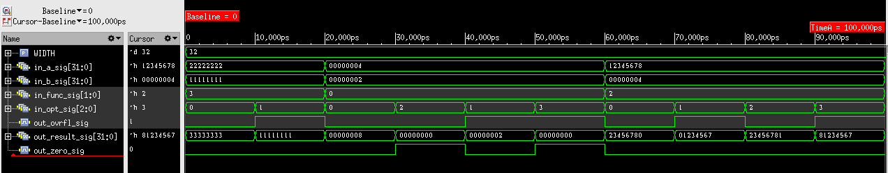

=============================================
Лабораторна робота №4
=============================================

Тема
------
Створення ALU

Специфікація
-------
  * Побітові операції
  * Операції зсуву
  * Додавання знакове та беззнакове 
  * Цілочисленне множення та ділення
  * Вихідні сигнали overflow та zero

Створення проекту
-------
В нашому проекті постала задача створення схеми ALU, яка представляе собою блок процесора, який відповідає за виконання логічнних та арифметичних операцій.
Для його реалізації було прийнято рішення відокремити операції в різні файли, для зручності і більшої читабилоності коду. Сема включає в собі операції
додавання, віднімання, ділення, множення, зсуви та бітові операції AND, NOR, XOR та OR. Вибір операцій здійснюється зв допомогою конструкції casez.
Загалом схема має два 32х бітні входи, на які подаються числа над якими буде виконана обрана операція та виход з результатом. Також на борту маємо два вихідних однобітових
прапорця overflow та zero. Прапорець overflow відповідає за переповнення і буде перемикатись лише при операціях додавання та віднімання, а zero буде встановлюватить
в 1 коли на виході маємо нульовий результат.

Для перевірки працездатності було використано тестбенч взятий у колеги з групи ДК-71 Видима Харчука.

RTL Схема ALU

.. image:: media/add_sub.png

RTL Схема блоку додавання/віднімання

RTL Схема блоку логічного блоку

RTL Схема блоку множення/ділення

waveform симуляції

Висновки
-------
В ході лабораторної роботи було створено ALU блок, який має змогу виконання логічнних та арифметичних операцій над цілими числами. Схема має два входа даних, вихід та прапорці
переповнення та перевірки на нуль. Виконавши по черзі всі операції в тестбенчі, можна казати, що схема працює коректно. При створенні проекту було виправлено багато помилок 
отриманих через свою "зеленість". Сам блок ALU буде використовуватись в майбутньому для створення mips процесора.
..

	Значна частина коду була запозичена з напрацювань Хапчука Вадима та Волинко Назара. 

