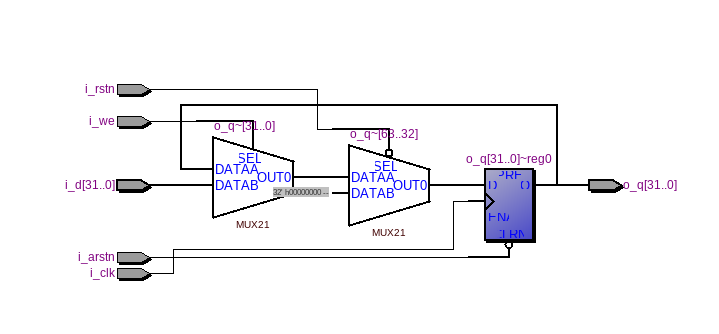
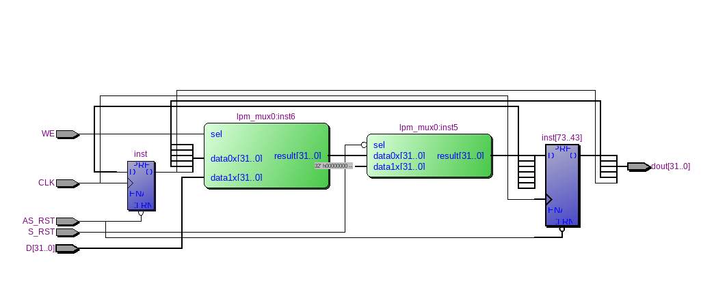

=============================================
Лабораторна робота №1
=============================================

Тема
------

Налаштування середовища розробки (Linux, Quartus, Incisive), тестовий проект

Хід роботи
-------

Для виконання поставленого завдання було необхідно встановити VirtualBox та Manjaro XFCE в нього. 
Після цього було проведено ряд оновлень та налаштувань для коректної роботи Virtual Box та Manjaro.
Наступним кроком було встановлення необхідних для виконання ПЗ, серед якого був Quartus II Web Edition 13.01 SP1 та Cadence Incisive 15.20.

Для початку було повторено проект з відео у тестовій директорії, потім можна було починати виконувати основне завдання. Завданням
було створити паралельний 32-розрядний регістр з асинхронним і синхронним скиданнями та входом дозволу у форматі за допомогою схемного редактора Quartus'a. Було створено такий проект, використавши
мультиплексори з бібліотеки мегафункцій та сконфігурувавши їх через MegaWizard. Після синтезу проекту було експортовано його у Verilog файл
та був написаний простий Testbench, що тестував можливості запису у регістр, його синхронного та асинхронного скидання. Після цього було відкрито директорію
проекту у ``Incisive``, скомпілював потрібні Verilog файли, виконав elaborate інстансу ``test bench`` та запустив ``test bench`` на симуляцію.
На виході симуляції було отримано поведінку, що відповідала очікуванням.

Після цього було створено реалізацію цього самого регістра на Verilog, що зайняло набагато менше часу. 
Ця реалізація запрацювала з тим самим, але оптимізованим(змінено назви пінів) тестбенчем відразу і без помилок.

Так виглядає RTL схема цього регістра, написаного на Verilog

Так виглядає RTL схема, реалізована у схемному редакторі з використанням мегафункції мультиплексора.

Як можна помітити, за розміром схеми відрізняються доволі сильно, а за функціональністю вони не відрізняються.

Висновки
-------

На основі проведеної роботи та виконаних завдань можна зробити наступні висновки: за допомогою Verilog можна створити складну схему швидше аниж її робити в схемному редакторі Quartus'a це по-перше
займає більше часу а по-друге схема буде виглядати громісткою.  Тому для кожгного розміру проекта краще використовувати різні методи його створення.

P.S. За основу було взято протокол у Олександра Шліхти.

