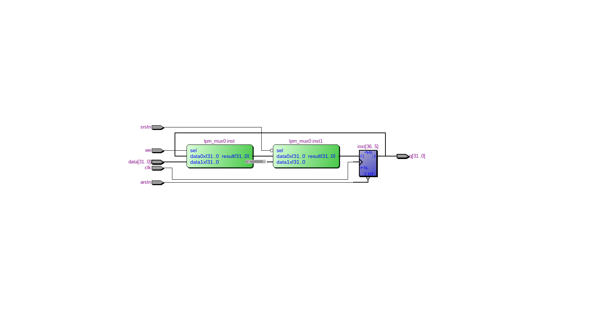

=============================================
Лабораторна робота №1
=============================================

Тема
------

Налаштування середовищ розробки: Linux, Quartus, Incisive.Створення тестових проектів

Хід роботи
-------

**Налаштування середовища.**  Основне завдання лабораторної роботи полягало в отриманні робочої Linux-системи, встановленню Quartus 13 та Cadence Incisive 15.10. Для початку було встановленно як другу ОС дистрибутив Linux Manjaro, через нестандартність заліза моєї системи, під час встановлення виникла низка проблем (проблеми з загружчиком, драйверами на відеоадаптер тощо.) які були успішно вирішенні. З встановленням софту особливих проблем не виникало, так як дії проводились за інструкцією

**Створення тестового проекту.**  Під час встановлення супроводжуючого ПЗ було повторено тестові проекти з відеолекцій. Вони виконували свої функції аналогічно з представленими у супутніх інструкціях. 
На Лабораторну роботу №1 необхідно було створити 32-розрядний регістр з асинхронним,синхронним скиданнями. Проект створенно на базі знань отриманих з курсу цифрової схемотехніки.В проекті було використано мультиплексори сконфігуровані через MegaWizard.

Ось так виглядає його RTL схема

.. image:: doc/reg32_async_reset.png
Для порівняння RTL схема регістру без синхронного скидання

Після компіляції проекту схему було експортовано в Verilog файл та написано автоматичний тест для економії часу. Після цього відповідний файл було просимульовано, та виправлено помилки пов'язані з багами у коді.

Висновки
-------

Нарисувавши вручну схему 32-бітного регістру, можна зробити висновки, що необхідно в короткий термін вивчити синтаксис мови Verilog,так як він дозволяє при невеликих часових затратах розробляти "масивні" схеми