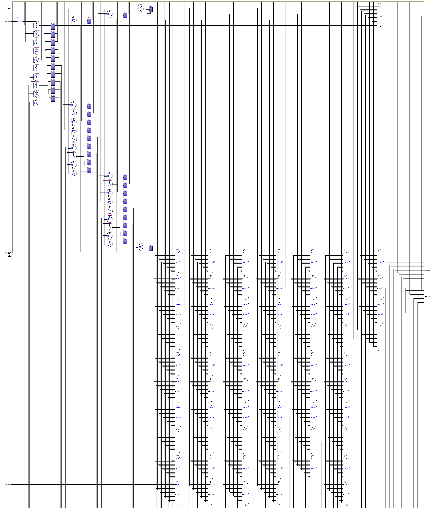
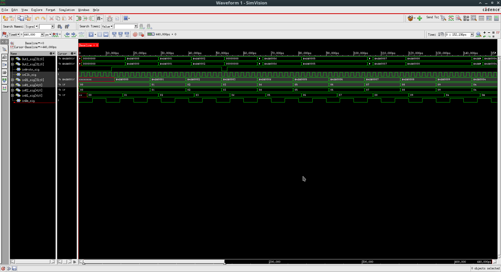

=============================================
Лабораторна робота №2
=============================================

Тема
------

Створення регістрового файлу ядра MIPS

Специфікація
-------
* Розрядність регістрів - 32 біти
* Кількість регістрів - 32
* Вхід асинхронного скидання та дозволу запису
* Вхід адреси запису та данних

Створення проекту
-------
В процесі виконання лабораторної роботи №2 було створено регістровий файл ядра MIPS розрядністю 32 біти та кількістю регістрів - 32. В проекті присутній сигнал асинхронного скидання(інверсний) , та дозволу запису. Сам же проект було реалізовано на мові Verilog з використанням певних функцій System Verilog. 

RTL Схема регістрового файлу 

waveform симуляції

Висновки
-------

В результаті виконання лабораторної роботи було створено тести для отриманого регістрового файлу. Створені перевірки проект успішно пройшов, після подання на вхід асинхронного скидання рівня логічного "0", данні які зберігались в регістрах обнуляються,при рівні логічної "1" данні успішно збергігаються або записуються в залежності від дій які здійснюються над n-регістром. Так як проект було реалізовано на мові Verilog, відповідно були розвинені навички програмування на ній.