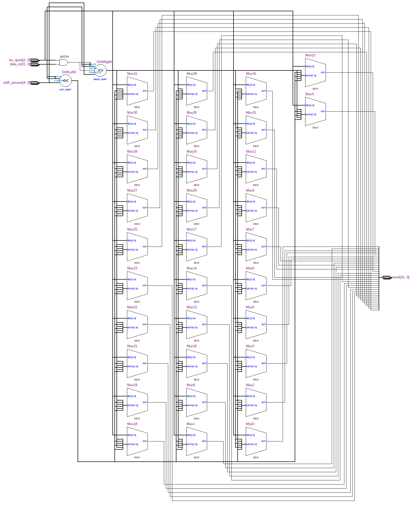
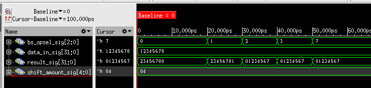

=============================================
Лабораторна робота №3
=============================================

Тема
------
Створення схеми "Barrel Shifter"

Специфікація
-------
  * SLL (shift left logical)
  * SRL (shift right logical)
  * ROL (rotate left)
  * ROR (rotate right)
  * SRA (shift right arithmetical)

Створення проекту
-------
Як і в інших лабораторних роботах проект було реалізовано на мові Verilog. В початковому варіанті для реалізації вибору типу зсуву, використовувалась конструкція if else. Та після отриманих викладачем рекомендацій
було вирішено використовувати конструкцію casez що дозволило позбутись "latch" та спростити сприйняття коду людям які потенційно можуть його використати. Для перевірки було написано простий тест, який послідновно змінював 
тип зсуву. Створений пристрій було протестовано спільно з колегою Назаром Волинко, так як ідеї для реалізації черпали з дискусії з викладачем, проблем при тестуванні не виявлено.

RTL Схема Barrel Shifter 

waveform симуляції

Висновки
-------

В результаті виконання лабораторної роботи було завершено роботу над пристроєм швидкого зсуву.Якщо вірити тестам отримано результати,які відповідають вірним. Вивчено нову конструкцію мови Verilog - casez.  