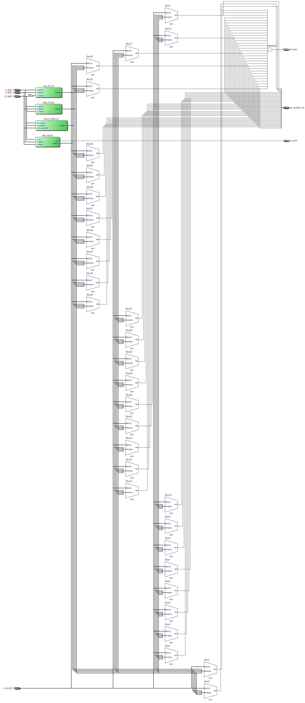
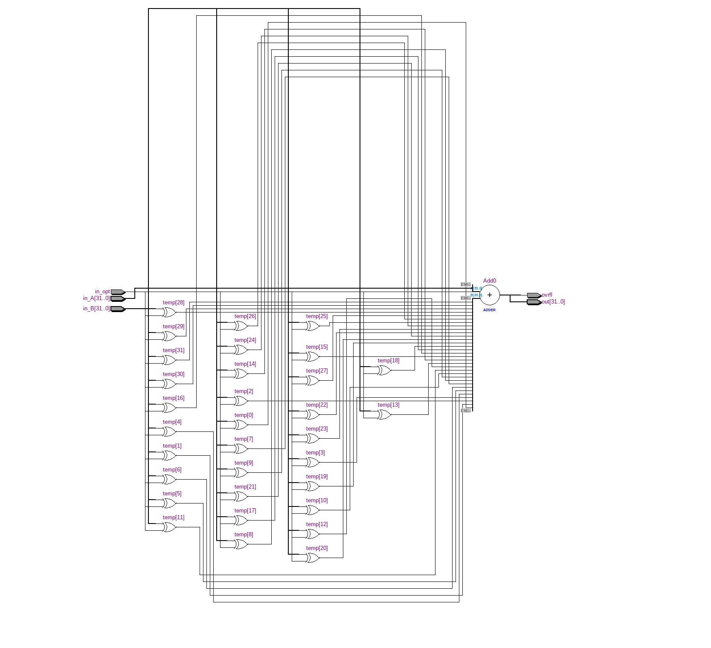
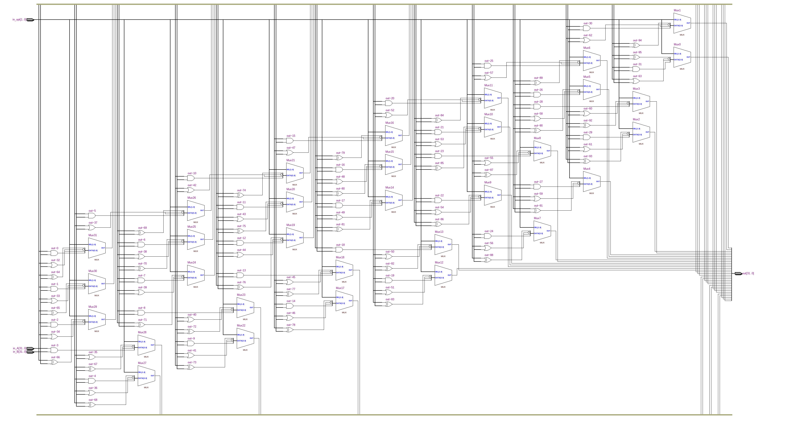
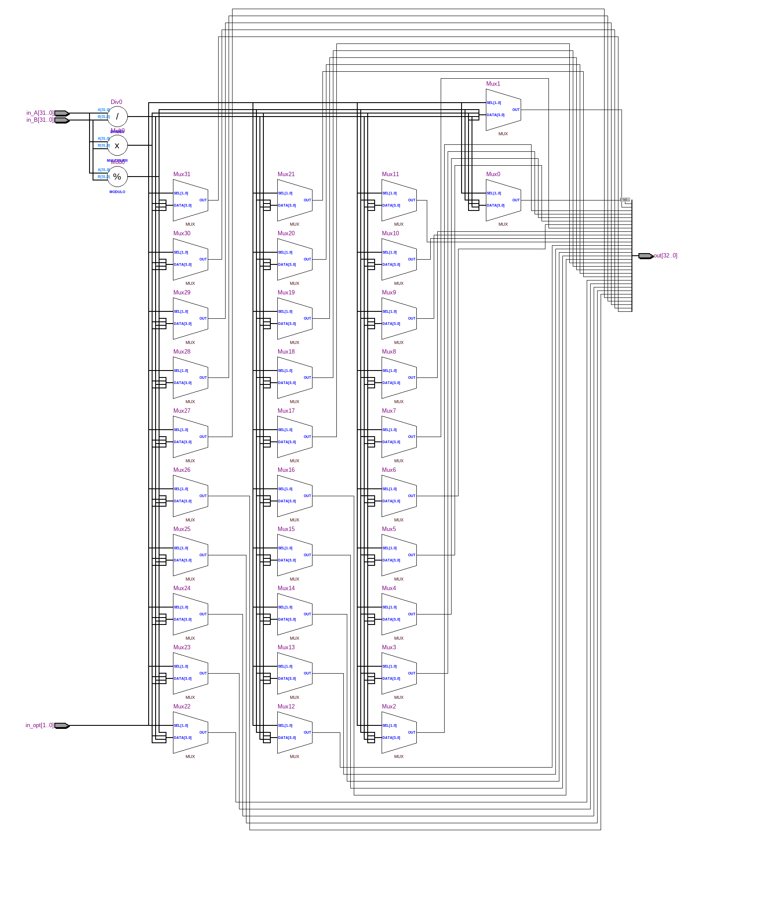
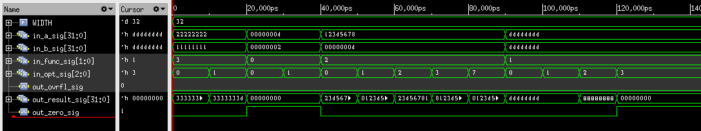

=============================================
Лабораторна робота №4
=============================================

Тема
------
Створення ALU

Специфікація
-------
  * Побітові операції
  * Операції зсуву
  * Додавання знакове та беззнакове 
  * Цілочисленне множення та ділення
  * Вихідні сигнали overflow та zero

Створення проекту
-------
Проект було реалізовано мовою Verilog. Сам проект було розділено на модулі відповідно до функцій які вони мали б виконувати. Для операції додавання, передбачено можливість переповнення. 
Також створенно вихідний сигнал zero рівень якого встановлюється в лог. "1" за умови отримання нулів після виконання операції. Це було зробленно з використанням конструкції casez, у варіанті default, за допомогою
нього ж реалізовано вибір опцій. Кожен модуль має також сигнал управління in_opt завдяки якому обираються операції в середині модуля. В цій роботі було використано пристрій швидкого зсуву, створений в лабораторній роботі №3

RTL Схема ALU

RTL Схема блоку додавання/віднімання

RTL Схема блоку логічного блоку

RTL Схема блоку множення/ділення

waveform симуляції

Висновки
-------

В результаті виконання лабораторної роботи ми отримали арифметично логічний пристрій. ALU або модулі створені для реалізації можна використовувати в подальших проектах. При його розробці, було вирішенно ряд проблем, для прикладу. Багато клопотів завдала звичайна неуважність при використанні сигналу in_opt, для одного модуля він був трьох розрядний для іншого ж одно, це відповідно призводило до результатів, що не відповідають нашим вимогам. Іншою проблемою було створення самих тестів, звичайне незнання, логіки роботи
параметрів в Verilog призвело до втрати дорогоцінного часу. За допомогою викладача, цю проблему було вирішено. Згідно з написаними тестами програма працює справно.
