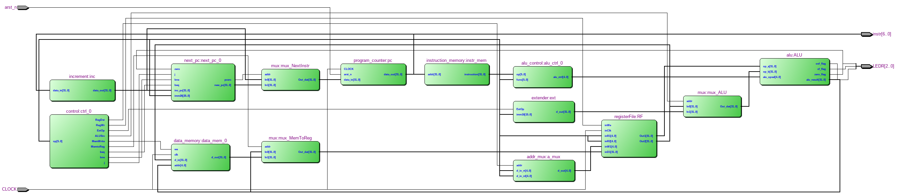
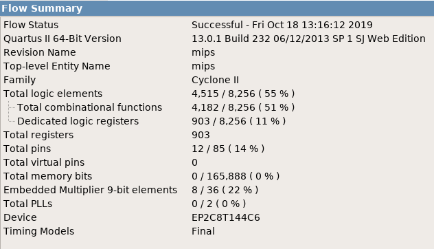

=============================================
Лабораторна робота №5-6
=============================================

Тема
------
Створення однотактного MIPS-подібного ядра

Специфікація
-------
Пристрій підтримує наступні існтрукції: add, sub, srl, xor, ror, sll, nor, slt, beq, mul_h, j, div, and, lw, rem, or, sw, sra, bne, mul_l, rol. 

Створення проекту
-------

Проект було реалізовано на мові Verilog. Створювавася проект поступово, з використанням лекції з створення MIPS подібного ядра записаною попередниками. Так як там всі елементи ядра створювались поступово. Спочатку було створенно  PC інкрементатор для нього та Instruction Memory. Далі було використано Регістровий файл, з минулої лабораторної, але зі змінами,які дозволили прибрати баги з готового MIPS подібного ядра.  Створенно мультиплексори які за сигналом RegDst задавали, якій тип інструкції буде використовувати ALU, тощо.ALU , при додаванні модуля створенного в минулій лабораторній роботі, виникли певні проблеми, при створенні цілісного MIPS ядра. Але ми живемо в еру капіталізму, тому криві руки одного програміста, можна замінити прямими руками іншого. Відповідно, для збереження нервів, та часу, було вирішено використати вже створенні, та відлажені модулі Олександра Шліхти, а саме : ALU, control Alu, MIPS control. Використані модулі, було дослідженно, для того щоб розуміти як вони функціонують. Отримане ядро має максимальну частоту в  7.38 MHz

RTL Схема Ядра

Використані ресурси

Максимальна частота

Висновки
-------
В результаті виконання  лабораторної роботи було створено однотактне RISC подібне ядро. Було вивчено принцип роботи процесору MIPS архітектури. На рахунок верілогу, дізнався що можна виконувати ініціалізацію з сторонніх файлів, і відповідно зберігати результати роботи девайсів, в інші файли. Як було сказано в пункті про створення проекту - капіталізм наше все. 