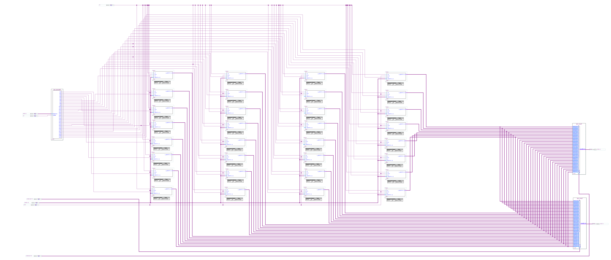

=============================================
Лабораторна робота №2
=============================================

Тема
------

Створення та верифікація регістрового файлу ядра MIPS

Хід роботи
-------

**Специфікація.** 
Розрядність регістрів -- 32 біти                                   
Кількість регістрів -- 32                                           
Вхід асинхронного скидання					   
Вхід дозволу запису                                                
Один вхід адреси запису та даних на запис                          
Два входи адреси читання та два виходи даних, що зчитуються        

**Створення проекту** 
Для того щоб зробити дану лабораторну роботу було знову переглянуто дані нам відео і розглянуто приклад реалізації на Verilog регістр 32 бітний 
код був розроблений Тимофієм Ходнєвим, як приклад. Потім з цього коду було реалізовано модель самого регістру ну і з цих моделей ми реалізували регістровий файл.
Побудували ми модель в схемному редакторі  Quartus SP13 показану викладачем, потім все я зкомпілював та зкробив RLT схему даного проекту. Потім було написано код для тесту. Потім запустили все в Cadence Incisible 
та зробили скрін отриманого результату. 
 Величезне дякую Волинку Назару за ідею реалізації считування кожного регістру. Звіт побудований на основі звіту Волинка Назара. Також слід зазначити що ідея використання коду на Vehrilog Тимофія Ходнєва регістру належить
 Назару Волинко , також ідея реалізації коду в test.v там де ми реалізовували перевірку кожного регістру також належить Назару Волинко. Слід зазначити що схема самих регістрів, як на мене громіздка і забрала досить багато часу на 
реалізацію. Тому якщо створювати більше регістрів з більшою кількістю розрядів то доречніше писати все на Vehrilog.  

Так виглядає схема регістрового файлу, реалізована у Quartus

.. image:: media/register_file_rtl.png
Так виглядає RTL схема цього регістрового файлу

.. image:: media/waveforms.png
Так виглядає частина Waveform симуляції

Висновки
-------
Була виконана лабораторна робота в якій ми вивчали та реалізовували в середовищі Quartus регістровий файл. В результаті було створено регістровий файл, який містить в собі 32 32-розрядних регістри. В цілому дана робота була виконана  
вірно, але при цьому були допущені ряд помилок ,які пов'язані з оформленням протоколу ,коду та форматі зображень. Дана робота знадобиться в подальшому для реалізації ядра MIPS, коли ми будемо всі напрацьовки зв'язувати між собою.
Також слід зазначити, що дана робота була ознайомчою для подальшої реалізації в серйозніших проектах. В майбутньому хочу все реалізувати на мові опису Verilog. 
 
