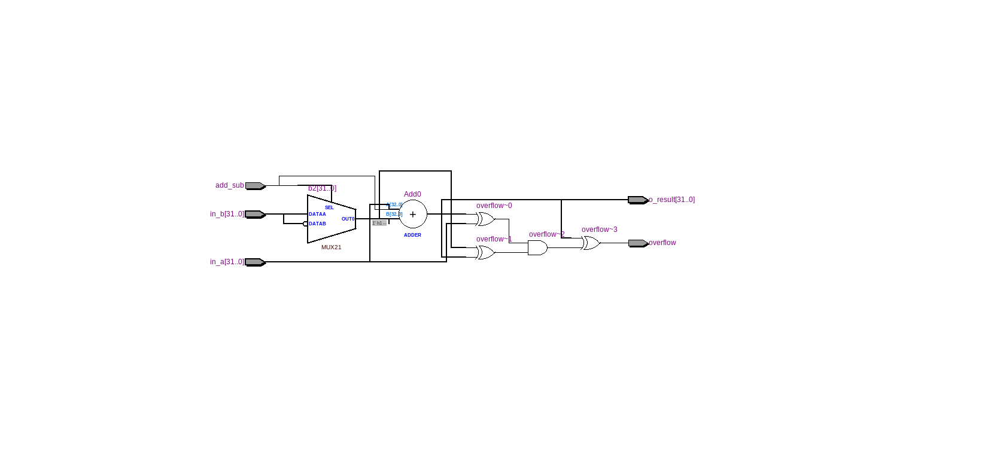
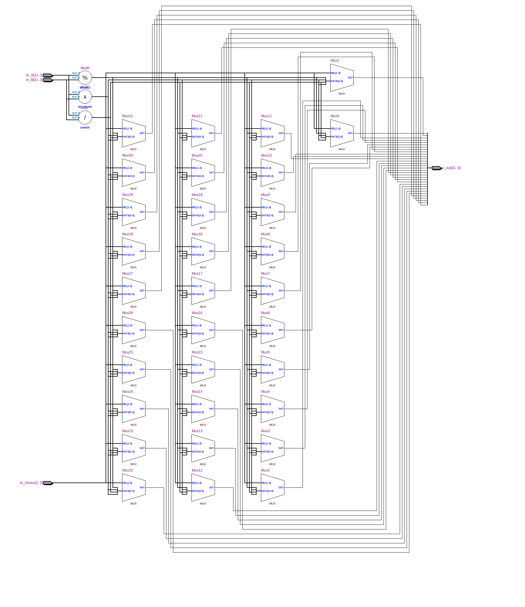
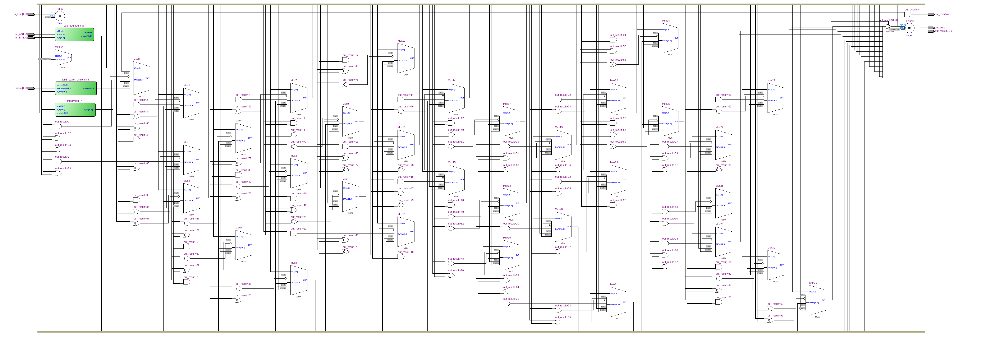

=============================================
Лабораторна робота №4
=============================================

Тема
------

Створення та верифікація АЛП

Хід роботи
-------

Специфікація Пристрій повинен виконувати такі операції:
  - Логічний та циклічний зсуви вправо та вліво, арифметичний зсув вправо
  - Додавання та віднімання знакових і беззнакових чисел
  - Множення і ділення цілих чисел
  - Бітові операції AND, NOR, XOR та OR
Також пристрій повинен мати вихідні сигнали overflow та zero.

Створення проекту Проект було вирішено створювати на мові Verilog, тому що це зайняло набагато менше часу, ніж створення схеми
у схемному редакторі. Для спрощення роботи над пристроєм мною було вирішено кожну дію виконати в окремому файлі(розділити по модулям), 
що дуже сильно спростило відладку пристрою. Також тут було використано, barrel shifter з попередньої лабораторної роботи, який не потребував відладки, 
що також трохи спростило створення та відладку пристрою. Потім мною було написано тестовий файл на мові Verilog, що допомогло відладити пристрій.

Опис пристрою Мій АЛП має 2 входи данних, один вихід данних. Також пристрій має 2 виходи прапорців:
  -> overflow - прапорець переповнення(фактично нам потрібен тільки при операціях додавання та віднімання, тому він дає коректну інформацію тільки
при цих операціях, при інших операціях не слід на нього звертати увагу.
  -> zero - прапорець нуля(якщо на виході маємо нуль, то значення прапорця набуває значення 1).
Операція, яку повинен виконати АЛП задається п'ятьма бітами адреси, де найстарші два біти відповідають за "тип" операції(зсув/арифметика/логіка),
а три молодшіі біти задають конкретно операцію, яку ми хочемо, щоб АЛП виконав. Результат всіх операцій розміщується у result_l. 
При операціях множення 2 бітних чисел результат виходить 64 бітним числом(LOW та HIGH частина). Тому при виводі результату множення використовуємо 
при виборі операції перший біт (5'b100?0): для LOW частини цей біт рівний 0, а при HIGH він рівний 1. І при діленні відповідно маємо результат 
та остачу ділення.  Для результату  цей біт поинен бути рівний 0, а при остачі він рівний 1. Більш детально вибір операцій розписано в тесті 
та головному модулі АЛП за допомогою коментарів.

Входи та вихід даних мають розрядність 32 біти. Як зазначалось раніше, проект складається з декількох модулів. Розглянемо RTL схеми деяких
з цих модулів.

Так виглядає RTL схема модуля суматора-віднімача.

Так виглядає RTL схема модуля для множення та ділення.

Так виглядає RTL схема головного модуля АПЛ.

.. image:: media/waveform.png
Так виглядає частина Waveform симуляції

Висновки
-------

В результаті виконання даної лабораторної роботи було розроблено блок АЛП для виконання логічних та арифметичних операцій над цілими числами.
Розроблений пристрій має 2 тридцятидвох розрядні входи даних(під операндами A і B), один тридцятидвох розрядний вихід даних(result),
а також прапорці переповнення та нуля, і п'яти бітний вхід адреси(завдяки якому обирається операція, яку повинен виконати АЛП).
Також в ході лабораторної роботи мною було здобуто знання зі створення та верифікації арифметично-логічного пристрою. Хотілось би також відміти,
що даний звіт був побудований на основі звіту Шліхти Олександра.

