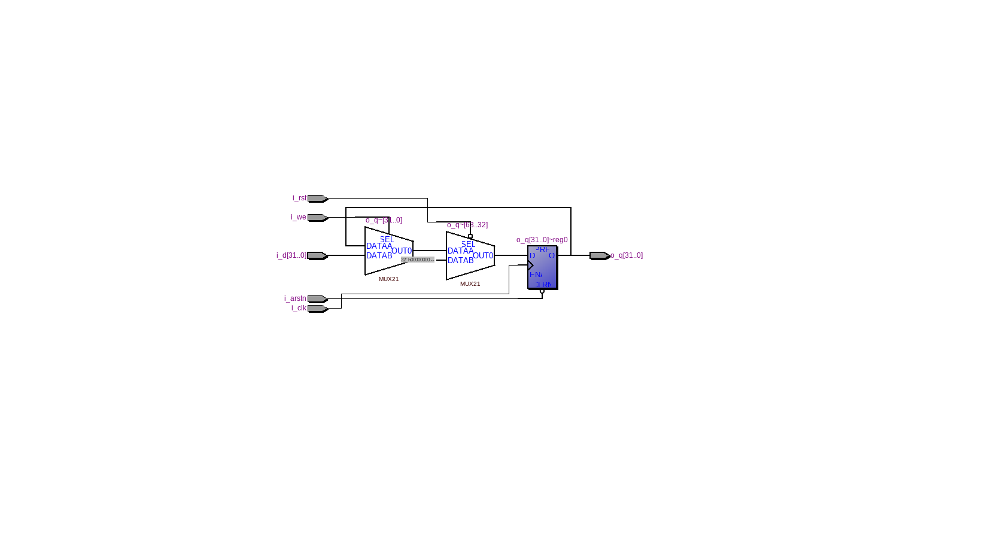
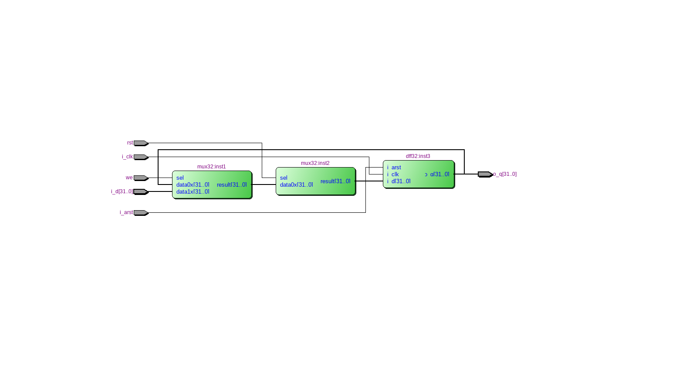
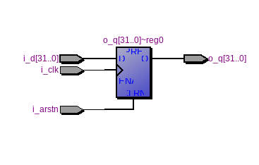

=============================================
Лабораторна робота №1
=============================================

Тема
------

Налаштування середовища розробки Linux, Quartus, Incisive, git.

Хід роботи
-------

**Налаштування середовища.** Для виконання завдання лабораторної роботи № 1 було необхідно встановити Manjaro XFCE на віртуальну машину. 
Після цього було проведено ряд оновлень та налаштувань для коректної роботи Virtual Box та Manjaro XFCE.
Наступним кроком було встановлення всього необхідного софта, серед якого був Quartus II 13.0.1 та Cadence Incisive 15.20.

**Створення тестового проекту.** Я повторив проект з відео у тестовій директорії, потім приступив до виконання основного завдання. Завданням
було створити 32-розрядний регістр з асинхронним, синхронним скиданнями та входом дозволу у форматі схеми та на Verilog. Я створив такий проект, використавши
мультиплексори з бібліотеки мегафункцій та D-тригерів, створених на Verilog. Після цього я написав реалізацію цього самого регістра на Verilog, що було набагато 
компактніше і зайняло набагато менше часу, тому що, він був майже реалізований на відео. Наступним кроком було тестування можливості запису у регістр, 
його синхронного та асинхронного скидання, тобто виконання симуляції.
Так виглядає RTL схема цього регістра, написаного на Verilog:

А так виглядає RTL схема, реалізована у схемному редакторі з використанням мегафункції мультиплексора:

А це RTL схема D-тригера написаного на Verilog:

Висновки
-------

На основі проведеної роботи та виконаних завдань можна зробити наступні висновки: створення складних схем, за допомогою схемного редактора 
перетворюється в дуже складну і довгу задачу, що може приводити до великої кількості складно відловлюваних помилок або багів.
Verilog завдяки модульності та компактності дуже добре підходить для таких задач як в плані розробки, так і в плані верифікації, тому краще використовувати 
саме його, але необхідно гарно його опанувати. Висловлюю окрему подяку Волинку Назару за допомогу в створенні git-репозиторію та коміту. 

