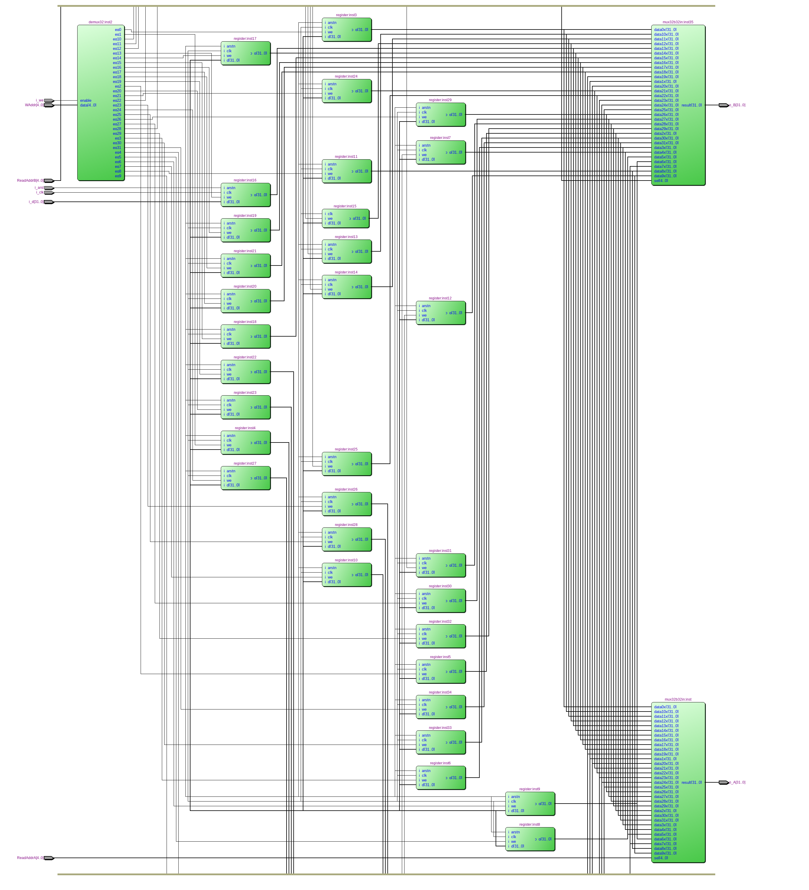
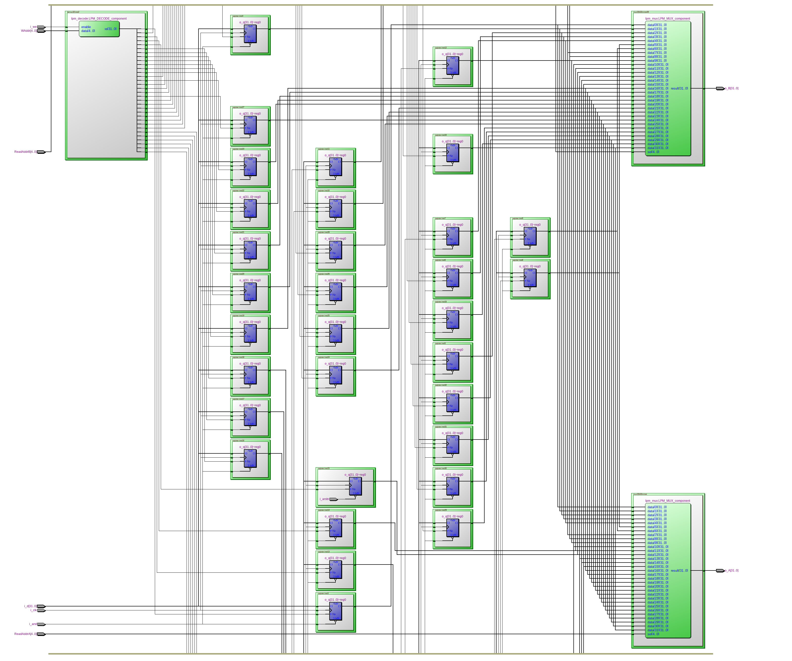
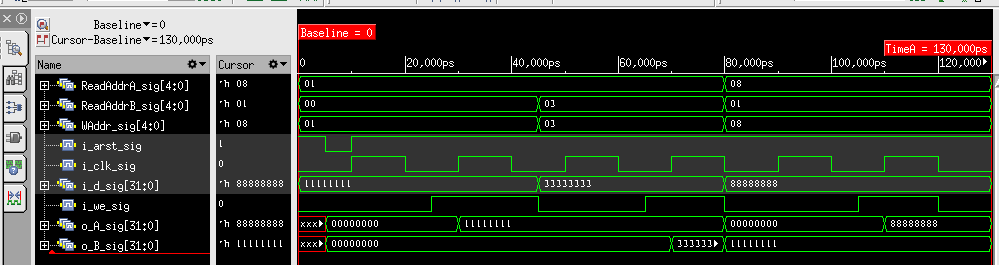

=============================================
Лабораторна робота №2
=============================================

Тема
------

Створення та верифікація регістрового файлу ядра MIPS

Хід роботи
-------

**Специфікація.** Після ознайомлення з завданням та необхідною ескізною схемою до лабораторної роботи, яка була надіслана.
 Елементи схеми: 

Розрядність регістрів -- 32 біти
Кількість регістрів -- 32 
Вхід асинхронного скидання
Вхід дозволу запису
Один вхід адреси запису
Один вхід даних для запису
Два входи адреси читання 
Два виходи даних, що зчитуються

**Створення проекту** З минулої лабораторної роботи був взятий 32-х бітний регістр на Verilog. 
Було взято 32 таких регістри. Інші компоненти були сттворені в WIZARD (один демультиплексор з 32-а виходами та два 32-х бітні, 32-х входові мультиплексори) 
в Quartus II 13.0.1, створювати їх необхідно дуже обережно, щоб не виникла помилка в Cadence Incisive 15.20 з якою я зіткнувся, необхідно було налаштувати компоненти в WIZARD ще раз.
Проект складаєтья з 32 регістрів для зберігання даних, двох мультиплексорів для зчитування даних з регістрів та 
одного демультиплексора, за допомогою якого відбувається вибір адреси для запису даних до вибраного регістру.
Я розробив схему графічно, а потім для неї був створений файл testbench. Я перевірив 3 регістри і вони справно працюють, що і видно в симуляції  
 Представляю результати отримані в RTL-viewer та Flatten Netlist. 

Так виглядає RTL-схема.

Так виглядає RTL схема у Flatten Netlist.

Так виглядає симуляція сигналів.

Висновки
-------

На цій лабораторній роботі був створений регістровий файл схема доволі громістка і тому для дослідження симуляції я опанував деякі знання мови Verilog в плані testbench, це дуже важливе вміння, яке суттєво економить 
час при моделюванні, в минулій лабораторній роботі я цього робити не вмів, тому проконсультувався. Дякую Волинко Назару за приклад оформлення в git та .gitignore та Єсичу Дмитру за відповіді по питанням із testbench.

