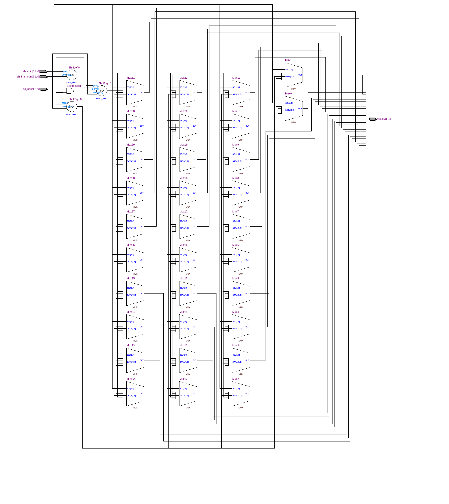
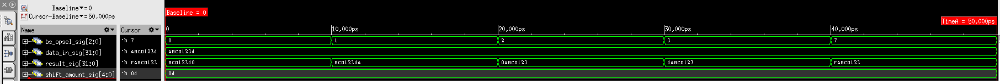

=============================================
Лабораторна робота №3
=============================================

Тема
------

Створення схеми "Barrel Shifter"

Хід роботи
-------

**Специфікація.** 
  * SLL (shift left logical)
  * SRL (shift right logical)
  * SRA (shift right arithmetical)
  * ROL (rotate left)
  * ROR (rotate right)

**Створення проекту.** Даний проект являє собою реалізацію пристрою Barrel shifter. Пристрій може виконувати вказану кількість операцій зсуву вліво та вправо,
відповідно ділення та множення на 2. Також можливий арифметичний зсув вправо та циклічні зсуви. Крім вхідного сигналу даних, наш Barrel shifter має вхідний сигнал відповідальний за вибір операції та кількість біт здвигу. 
Пристрій реалізований за допомогою мови Verilog. Щоб мати змогу обирати тип зсуву, було використано конструкцію casez, що дозволило позбутись "latch". 
Для перевірки пристрою було створено тестбенч, щоб перевірити кожен вид зсуву. 
Тест було взято з напрацювань Харчука Вадима та модифіковано.

Так виглядає RTL-cхема Barrel shifter:

Так виглядає cхема Technology Map Viewer (Post-Fitting):
.. image:: image/barrel_shifter_PF.png 

Так виглядає симуляція в Incisive:

Висновки	
-------
В результаті виконання лабораторної роботи було створено пристрій швидкого зсуву. Реалізовано побітові зсуви вліво та вправо, 
арифметичний зсув вправо та циклічні зсуви. 
Логічний зсув - це зсув, при якому біт, який зсувається зникає, не впливаючи на біти, що залишились, а замість нього записується 0. 
При арифметичному зсуві вліво веде себе як логічний зсув вліво, при арифметичному зсуві вправо: минає біт найнижчого розряду, не впливаючи на біти, що залишилися,
а на місце біта найвижчого розряду встановлюється біт, відповідний знаку, тобто біт найвижчого розряду до зсуву дублюється.
При циклічному зсуві крайній біт переміщається з одного кінця числа в інший кінець. 

Виконавши симуляцію, я перевірив його коректну роботу. Обмінявся симуляціями з Волинко Назаром, зсуви справно працюють. В процесі створення проекту було вивчено 
конструкцію casez та $signed мови Verilog, про які було обговорено в чаті групи. 

