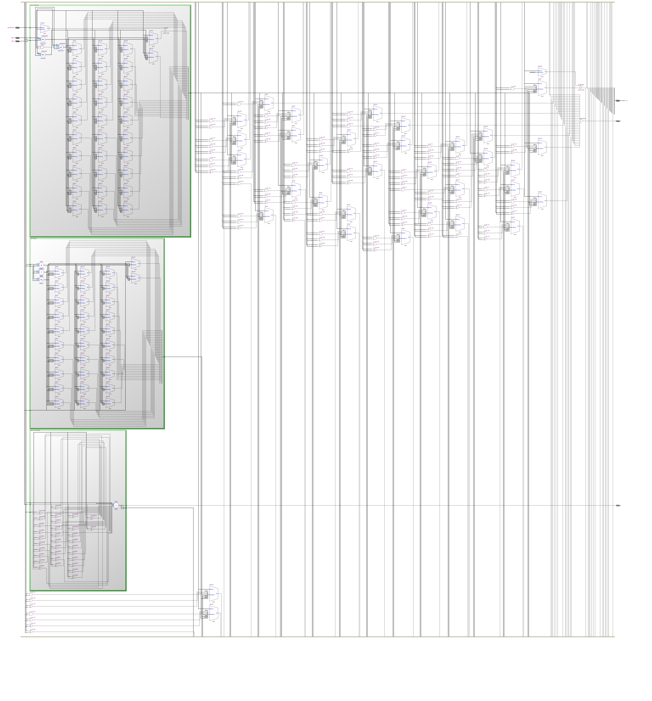
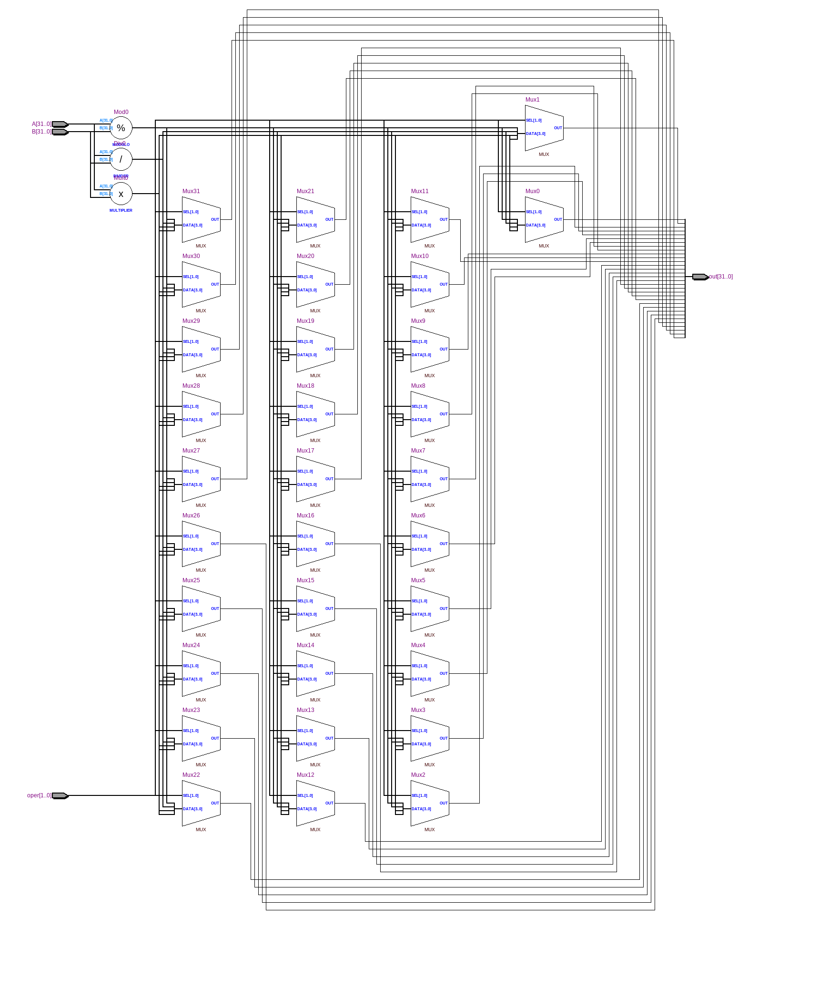
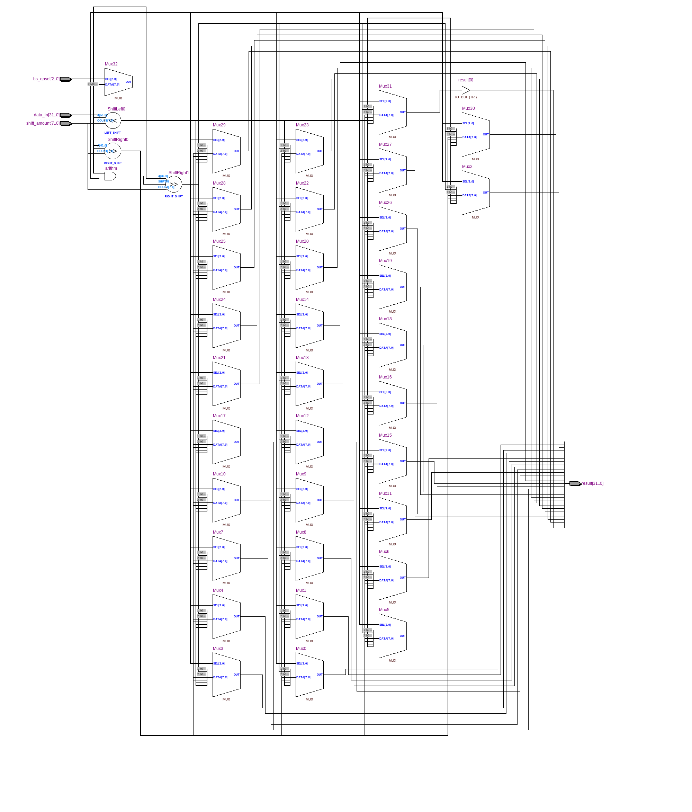
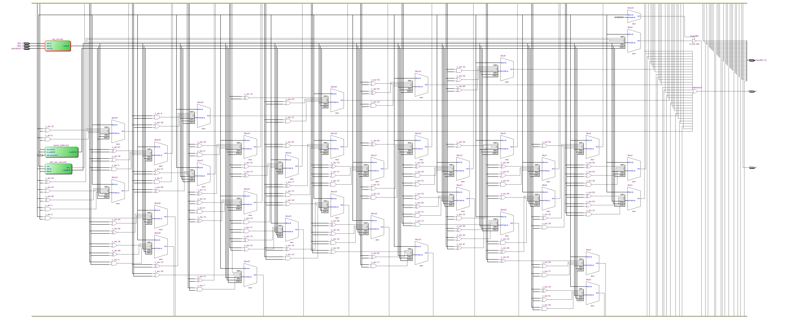
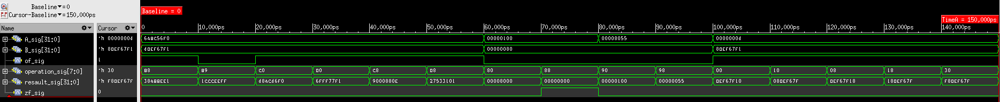

=============================================
Лабораторна робота №4
=============================================

Тема
------

Створення АЛП

Хід роботи
-------

**Специфікація** 
Пристрій повинен виконувати такі операції:
	- Логічний та циклічний зсуви вправо та вліво, арифметичний зсув вправо
	- Додавання та віднімання знакових і беззнакових чисел
	- Множення і ділення чисел
	- Бітові операції AND, NOR, XOR, OR
Також пристрій повинен мати вихідні сигнали overflow та zero.

**Створення проекту** Проект створювався на мові Verilog, тому що схема дуже велика(це дуже помітно по скрінах, особливо ``Flatten Netlist``)
для схемного редактора. Мені до вподоби більше, щоб усе було в одному файлі й тому я обрав саме цей шлях, плюс до того, я думаю це зробить зручнішою 
збірку нашого ``MIPS``. 

**Опис пристрою** АЛП має 2 входи адреси, один вихід данних та 2 виходи прапорців:
	-> ``overflow`` - прапорець переповнення, активний коли з'являється додатковий розряд, насамперед у додаванні і відніманні, він дає коректну 
інформацію тільки при цих операціях, при інших операціях не слід на нього звертати увагу.
	-> ``zero`` - прапорець нуля, активний коли нуль на виході.

Операція, яку повинен виконати АЛП задається п'ятьма бітами адреси, де найстарші два біти відповідають за "тип" операції(зсув/арифметика/логіка),
а три молодші біти задають конкретну операцію, яку ми хочемо, щоб АЛП виконав, решта(три молодші біти) нулі, за винятком add і sub.  
При операціях множення результат виходить 64 бітним числом та розбивається на дві рівні частини: нижні розряди та верхні. Також реалізовано діленя 
та остачу від ділення.   

	Flatten Netlist схеми:

	RTL-схема модуля суматора-віднімача:
.. image:: media/add_and_sub_add1.png

	RTL-схема модуля для множення та ділення:

	RTL-схема barrel shifter:

	RTL-схема АПЛ:

	Waveform симуляція:

Висновки
-------

В результаті виконання даної лабораторної роботи було розроблено АЛП для виконання логічних та арифметичних операцій над числами.
Я здобув знання про будову, створення та функціональність арифметично-логічного пристрою. Код було взято 
в Дмитра Єсича, але я його доопрацював, а ``testbench`` написав сам. Надалі цей АЛП послужить у створенні MIPS.
