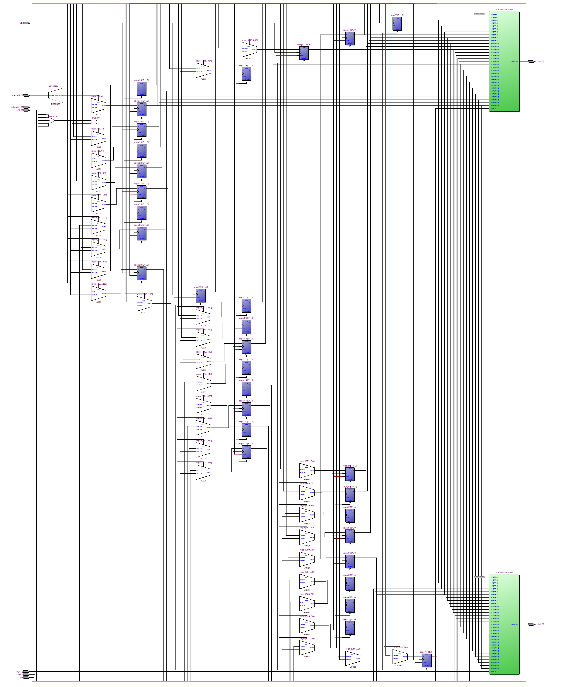
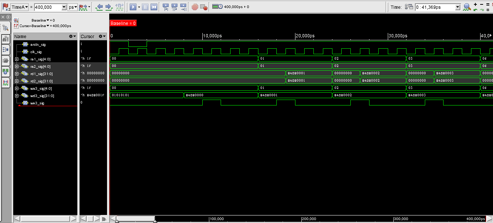

=============================================
Лабораторна робота №2
=============================================

Тема
------

Створення та верифікація регістрового файлу ядра MIPS

Хід роботи
-------

**Специфікація.** Після перегляду презентації з лекції №4 та завдання вимоги до до дизайну були прийняті наступні:

* Розрядність регістрів -- 32 біти

* Кількість регістрів -- 31 (звернення за адресою 0 повертає 0 при читанні та не зберігає значення при записі)

* Вхід асинхронного скидання, вхід дозволу запису

* Один вхід адреси запису та даних на запис

* Два входи адреси читання та два виходи даних, що зчитуються

**Створення проекту.** Проект було вирішено реалізувати на HDL SystemVerilog, як більш функціональному наступнику Verilog. Проект був розбитий на два 
модулі -- власне блок регістрів та параметрично настроюваний модуль мультиплексора. Причина такого рішення полягає у тому, що модуль мультиплексора є універсальним та може використовуватися в інших модулях, а такж у тому, що у ``RTL Viewer`` Quartus'a при використанні модульності можна отримати більш зрозумілу картину.

Так виглядає RTL схема регістрового файлу, написаного на SystemVerilog.

Так виглядає частина waveform з симуляції.

**Примітка:** Щоб файли вихідного коду було видно у NCLaunch, можна зайти до каталогу ``src/`` та виконати: 

``ls *.sv | xargs -I {} ln -s {} {}.v``

Висновки
-------

Під час виконання лабораторної роботи я значно поглибив свої знання мов Verilog та SystemVerilog, навчився розбивати створювані реалізації на модулі
та параметризувати їх.

