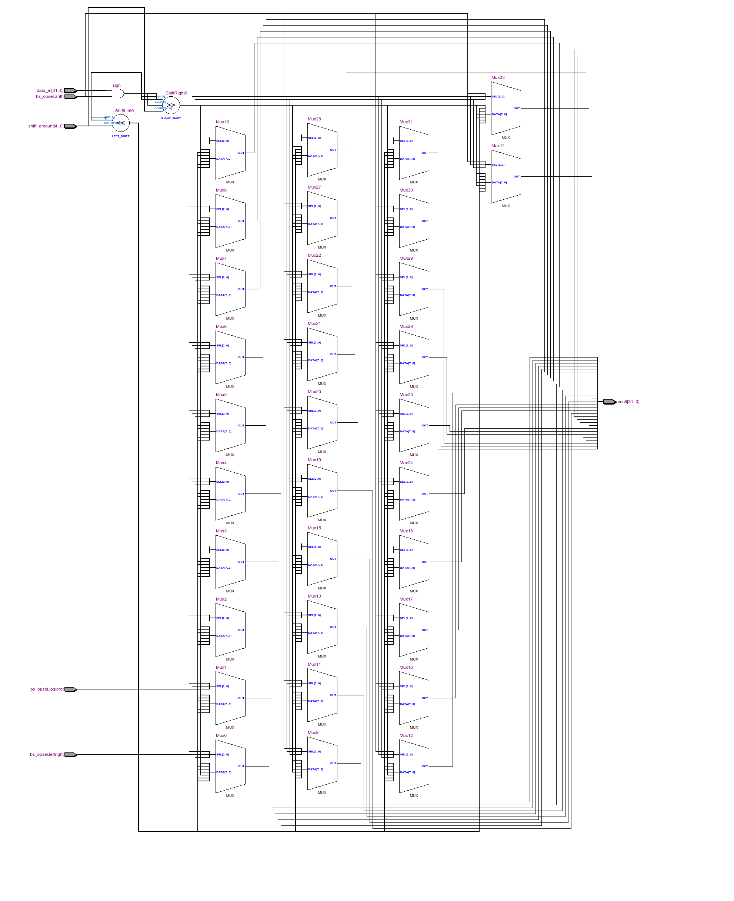
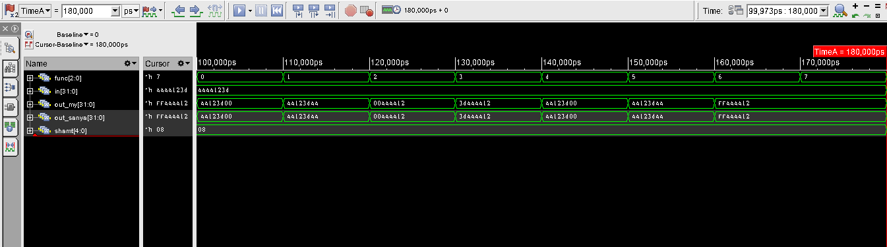

=============================================
Лабораторна робота №3
=============================================

Тема
----------

Створення та верифікація модуля ``barrel shifter``

Хід роботи
----------

**Специфікація.** Специфікація була визначена явно у завданні:

Реалізувати 32-бітний Barrel Shifter, який може виконувати:

* SLL (shift left logical)
* SRL (shift right logical)
* ROL (rotate left)
* ROR (rotate right)
* SRA (shift right arithmetical)

У реалізації повинні використовуватися один елемент зсуву вліво, один - вправо, 32 елементи AND і 32 шинних мультиплексори.
Обмінятися реалізаціями з колегою та порівняти результати.
 

**Створення проекту.** Проект було вирішено реалізувати на HDL SystemVerilog, як більш функціональному наступнику Verilog. Він складається з одного модуля
та повністю параметризований. У ході виконання лабораторної роботи я обмінявся реалізацією з `Шліхтою Олександром <https://github.com/drcah4ec>`_ та додав 
його реалізацію до свого тестбенчу для того, щоб легко порівнювати результати симуляції. Для полегшення своєї важкої праці я написав Makefile, який теж був майже повністю параметризований. Модуль мого одногрупника виявився повністю робочим, як і мій, тому результати однакові.

Так виглядає RTL схема Barrel Shifter'а, написаного на SystemVerilog.

Так виглядає частина waveform з симуляції.

Висновки
-----------

Під час виконання лабораторної роботи я значно поглибив свої знання мов Verilog та SystemVerilog, створив універсальний параметризований модуль та Makefile для швидкої компіляції та симуляції проекту.

