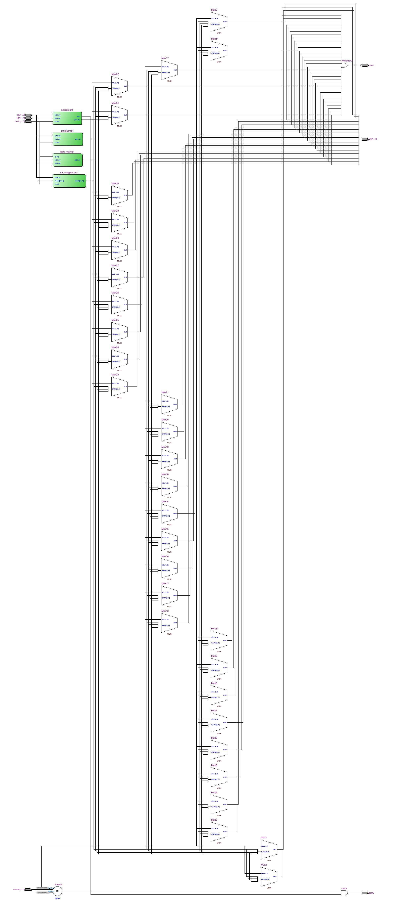

=============================================
Лабораторна робота №4
=============================================

Тема
----------

Створення та верифікація модуля АЛУ

Хід роботи
----------

**Специфікація.** Специфікація була визначена явно у завданні.
Реалізувати АЛУ, яке може виконувати:

* операції логічного, циклічного, арифметичного зсуву 
* додавання/віднімання з і без впливу на вихід переповнення
* знакового множення/ділення
* логічних операцій
* мати виходи флагу переповнення та флагу нуля

**Створення проекту.** Проект було вирішено реалізувати на HDL SystemVerilog, як більш функціональному наступнику Verilog. 
Він складається з багатьох модулів, що описані в одному файлі та повністю параметризований. У якості модуля використовувався також barrel
shifter з минулої лабораторної. Для спрощення архітектури я дещо видозмінив завдання: замість 64-бітного виходу реалізований 32-бітний, а операції
множення та ділення розбиваються на старшу та молодшу частину. 

**Що зроблено.**
Операції було розділено на блоки 4х4 для простоти та зручності керування. Два старші біти визначають тип інструкції (дії на суматорі, множення/ділення, логічні 
операції, операції зсуву). Два молодші вже визначають, яка саме інструкція у вибраному блоці буде виконана. Таким чином, використано 16 кодів інструкцій з 64. 
Розділення операцій множення та ділення на дві дуже органічно підійшло до такої упаковки; проте, довелося пожертвувати операцією ``ROL``.

Для верифікації було прийнято використовувати випадкові дані та функціональний аналог АЛУ високого рівня. Вихід низькорівневого АЛУ порівнюється з виходом високорівневого, та у разі неспівпадіння виходів виводиться попререджувальне повідомлення. Тест можна налаштувати на довільну кількість ітерацій.
Також був виконаний синтез у Quartus та отримана RTL-схема пристрою.

Так виглядає RTL схема ALU, написаного на SystemVerilog.

.. image:: media/wform.png
Так виглядає частина waveform з симуляції.

Висновки
-----------

Під час виконання лабораторної роботи я створив параметризований та розширюваний модуль АЛУ для однотактного процесора MIPS.
Поведінка модуля за результатами тестів відповідає очікуванням. Тести було запущено в ``ncsim``. Так як АЛУ парамтризований, він
може бути як 32, так і 8 біт, і коректність його поведінки від цього не змінюється. Отже, лабораторна робота виконана успішно.

