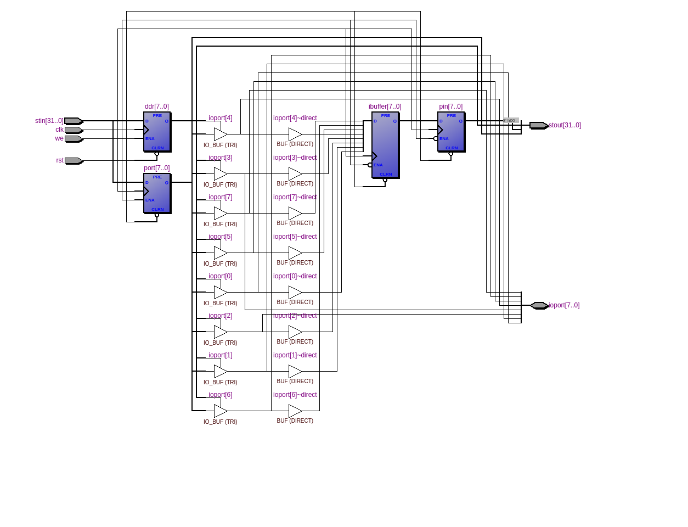

=============================================
Лабораторна робота №7
=============================================

Тема
----------

Додавання memory mapped peripherals до ядра (GPIO)

Хід роботи
----------

**Специфікація.** Специфікація була визначена явно у завданні.

* реалізувати модуль GPIO
* захист від метастабільності
* прикрутити до ядра, повинно працювати на читання, запис
* тестбенч
* написати на асемблері код ШИМ та перетворити його на текстовий файл з двійковими інструкціями
* перевірити на працездатність

**Створення проекту.** Проект було вирішено реалізувати на HDL SystemVerilog, як більш функціональному наступнику Verilog. 
Він складається з багатьох модулів, що описані в декількох файлах. У якості модуля використовувався також MIPS з минулої лабораторної. 
GPIO 8-бітний, що дозволяє працювати з ним за допомогою лише одного регістру.

**Що зроблено.**
Усі вимоги, зазначені у специфікації, було виконано. Я реалізував 8-бітний модуль порту вводу-виводу, передбачив захист від метастабільності шляхом
додавання одного проміжного регістру на вхід. прикрутив до ядра, замапив на адресу 0х80. Написав програму на своєму SEDсемблері,
у тестбенчі провів маніпуляцію з GPIO та показав на вейаформі, що скважність міняється згідно програми. частота ядра
була знижена до 1.5 мгц з міркувань безпеки. Детальна інформація по інструкціям у sed-скрипті.

Так виглядає RTL схема gpio, написаного на SystemVerilog.

Висновки
-----------

Під час виконання лабораторної роботи я прикрутив периферійний модуль до ядра шляхом
відображення у пам'ять, навчився працювати з двонаправленими портами, захищати порт від метастабільності та написав програму, що
виконує функцію ШИМ контролера.

