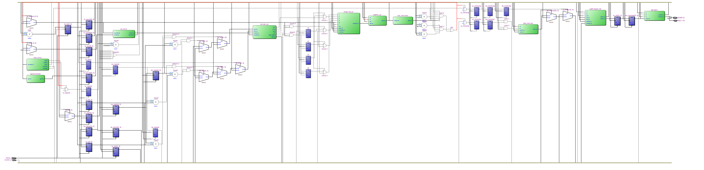
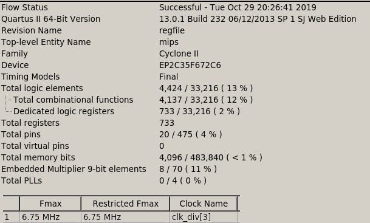

=============================================
Лабораторна робота №8
=============================================

Тема
----------

Конвеєризація саморобного RISC ядра.

Хід роботи
----------

**Завдання.**
Завданням було конвеєризувати ядро, що було зроблене в 5-7 лабораторних, переконатися у коректній його роботі 
та побороти pipeline hazards, що при цьому виникають. Як тестову програму використати програму для маніпуляції GPIO  з
лаби №7.

**Створення проекту.** Проект було вирішено реалізувати на HDL SystemVerilog, як більш функціональному наступнику Verilog. 
Він складається з багатьох модулів, що описані в декількох файлах. У якості модуля використовувався також ALU, GPIO та решта модулiв MIPS з минулої лабораторної. 

**Що зроблено.**
Усі вимоги, зазначені у специфікації, було виконано з деякими модифікаціями, а саме.
Від еталонного MIPS ядра моє ядро відрізняється 4-стадійним конвеєром замість 5-стадійного, наявністю регістрів флагів та умовного переходу по ним.
Ядро має байпас для боротьби з простоєм конвеєра, а затримки при переходах реалізовані за допомогою branch delay slot. 
Частина модулів параметризована як *reusable*, а частина є немасштабованими через несумісність з набором інструкцій фіксованої довжини.
У процесі розробки ядра був нарешті допилений асемблер, тож тепер можна просто писати програми замість
громіздких бінарних інструкцій. Єдине що він не вміє це переходити по мітках, що не були задекларовані, 
цей функціонал був присутній у асемблері для іншого процесора, але не портований на цю архітектуру через лінощі.
Я зібрав міпс у Quartus, визначив  максимальну тактову частоту за допомогою time quest timing analyzer, 
вона виявилася вже більшою: 6.75 проти 3.4 МГц. Проте, якщо прибрати схему ділення з АЛУ, частота зростає до 50 (раніше 24) МГц.
На своєму асемблері переписав програму керованого ШИМ з 7 лаби та перевірив в Incisive, що все працює як треба.

Так виглядає RTL схема mips, написаного на SystemVerilog.

Так виглядають ресурси використані у цьому ядрі.

Висновки
-----------

Під час виконання лабораторної роботи я конвеєризував своє однотактне MIPS подібне ядро відповідно до специфікації, написав свій асемблер
для своєї архітектури на C i ``flex/bison``. Переписав на ньому програму з 7 лаби та перевірив у симуляції. Конвеєризація процесора виявилася досить складною,
проте вона дала значний виграш у продуктивності без значних витрат ресурсів.

