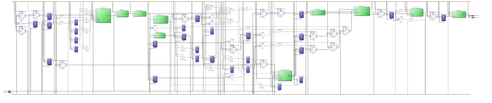
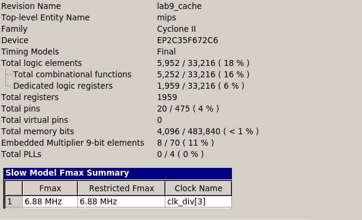

=============================================
Лабораторна робота №9
=============================================

Тема
----------

Додавання кеш-пам'яті до конвеєрного RISC ядра.

Хід роботи
----------

**Завдання.**
Завданням було прикрутити до конвеєрного ядра з 8 лаби кеш даних як посередник між пам'яттю даних та процесором.
Тип кешу не задавався, тому я вирішив зробити асоціативний кеш.

**Створення проекту.** Проект було вирішено реалізувати на HDL SystemVerilog, як більш функціональному наступнику Verilog. 
Він складається з багатьох модулів, що описані в декількох файлах. У якості модуля використовувався також ALU, GPIO та решта модулiв MIPS з минулої лабораторної. 

**Що зроблено.**
Усі вимоги, зазначені у специфікації, було виконано. Пам'ять даних було вирішено зробити з 128-бітною шиною даних
для виконання транзакцій в кеш за один такт. Кеш 4-слівний, 2 лінії на модуль, 4-асоціативний, слово 32 біти. 
політика витіснення LRU, працює за 1 такт при попаданні
та 2 такти при промаху. 
На своєму асемблері переписав програму сортування з 6 лаби та перевірив в Incisive, що все працює як треба.

Так виглядає RTL схема mips, написаного на SystemVerilog.

Так виглядають ресурси використані у цьому ядрі.

Висновки
-----------

Під час виконання лабораторної роботи я прикрутив до конвеєрного RISC ядра кеш-контролер, що зберігав у собі 
часто використовувані дані з основної пам'яті. Такий контролер можна використовувати для будь-яких типів пам'яті, які можна підключити як зовнішні модулі.
кеш асоціативний та багатолінійний, що дає оптимум по швидкодії та проценту попадань.

