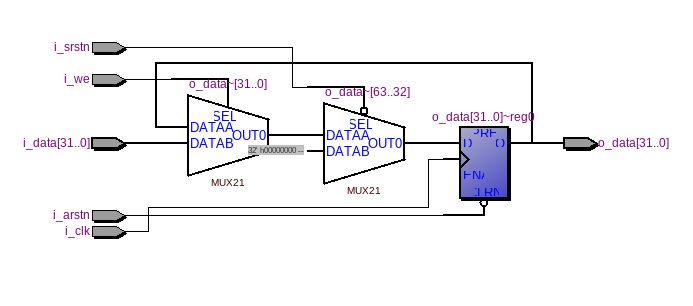
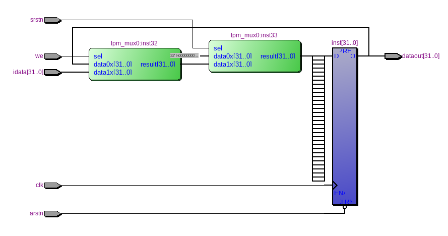

=============================================
Лабораторна робота №1
=============================================

Тема
------

Налаштування середовища розробки (Linux, Quartus, Incisive), тестовий проект

Хід роботи
-------

**Налаштування середовища.** Для виконання завдання лабораторної роботи № 1 встановлено Manjaro на Virtual Box. 
Потім було встановлено Quartus 13 SP1 та Cadence Incisive 15.10.

**Створення тестового проекту.** Повторивши всі кроки з відео створено в Quartus регістр та просимульовано його роботу в Incisive. Основним 
завданням Л.Р. було створення 32-розрядного регістру з асинхронним, синхронним скиданнями та write enable. Даний проект створено на основі
тригерів та мультиплексорів та синтезовано в Quartus. Після синтезу проект експортовано у Verilog файл, створивши Testbench файл, в якому 
описано вхідні сигнали, було просимульовано даний проект в Incisive. 

Після цього було реалізовано цей самий регістр на Verilog, що було набагато компактніше і зайняло набагато менше часу. 
Ця реалізація запрацювала з тим самим тестбенчем відразу і без помилок.

Так виглядає RTL схема цього регістра, написаного на Verilog

Так виглядає RTL схема, реалізована у схемному редакторі з використанням мегафункції мультиплексора.

Результат роботи даних схем повністю ідентичний.

Висновки
-------

На даній лабораторній роботі ми отримали навики моделювання схем в середовищі Quartus та їх симуляції в Incisive. Ознайомились з мовою Verilog, 
яка, як показує практика виконання цієї роботи, значно полегшує та прискорює створення проектів ( оегістр написаний на Verilog створено в рази швидше 
ніж регістр реалізований в схематиці) 

