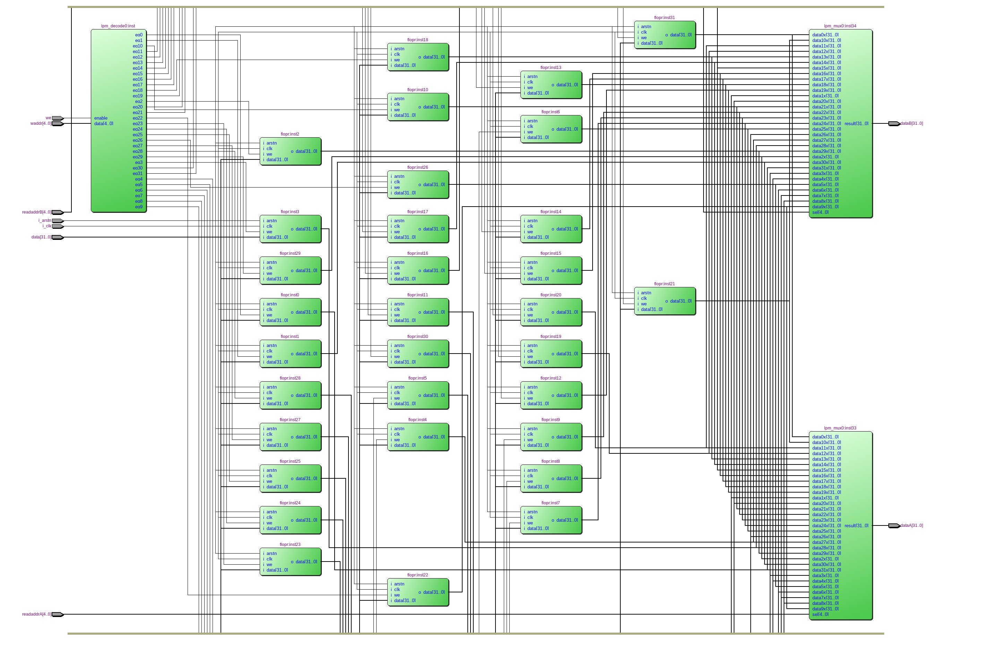
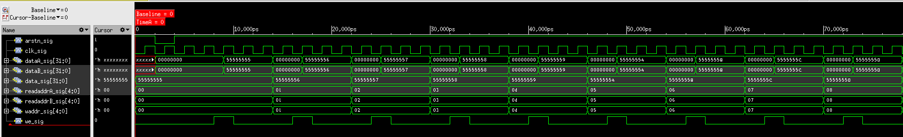

=============================================
Лабораторна робота №2
=============================================

Тема
------

Проектування та реалізація регістрового файла з функціями зчитування та запису даних

Хід роботи
-------

**Теоретичні відомості** Цифрові системи часто використовують кілька регістрів для
зберігання тимчасових змінних. Такі групи регістрів, які
називаються регістровими файлами, зазвичай реалізуються у вигляді
невеликих багатопортових матриць статичного ОЗУ, оскільки вони
більш компактні, ніж матриці тригерів. Регістровий
файл має два порти для читання readaddrA, readaddrB і один порт для
запису waddr.Пятіразрядні адреси waddr, readaddr забезпечують
доступ до будь-якого з 32 регістрів. Таким чином, одночасно
можна записувати інформацію в два регістра і зчитувати з одного.

**Реалізація проекту.**  Проект складаєтья з 32 регістрів для зберігання даних, двох мультиплексорів для 
зчитування даних з регістрів (На вхід readaddr мультиплексора подається адресса регістру з якого відбудеться 
зчитування і мультиплексор приймає вихідний сигнал з відповідного регістра.) та декодера (За допомогою декодера вибирається адресса регістру в який будуть записуватись дані). 
За основу регістрового файлу взято регістр, створений в минулій Л.Р. 

.. image:: media/lab2_scheme.png
Рис.1 Схема цього регістра, реалізованого в Quartus.

Рис.2 RTL схема даного проекта.

Рис.3 Результати симуляції.

Висновки
-------

На даній лабораторній роботі реалізовано регістровий файл на базі 32 регістрів створених на минулій Л.Р. Результат, отриманий під час симуляції 
регістрового файла задоволняє поставлені задачі ( виконується запис та зчитування у всіх регістрах). Створений модуль регістрового файлу використовують
в статичній пам'яті. Як на мене, мінусом даної реалізації є те, що запис та зчитування відбувається з різних портів, тоді як в класичній архітектурі
через будь-який порт можна записувати та зчитувати.

