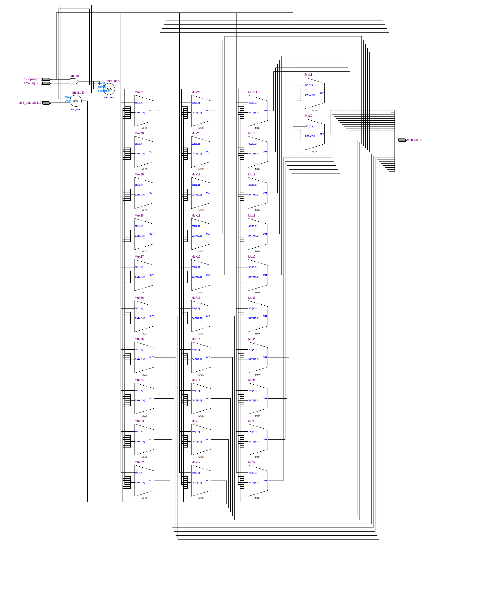
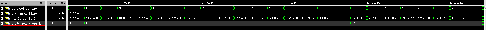

=============================================
Лабораторна робота №3
=============================================

Тема
------

Створення та верифікація пристрою швидкого зсуву

Хід роботи
-------

**Специфікація** Пристрій повинен виконувати такі види зсуву:
	- Логічний зсув вліво
	- Логічний зсув вправо
	- Арифметичний зсув вправо
	- Циклічний зсув вправо
	- Циклічний зсув вліво

**Створення проекту** Проект було вирішено створювати на мові Verilog, тому що це зайняло набагато менше часу, ніж створення схеми
у схемному редакторі. Пристрій складається з двох елементів зсуву, елементу "AND" та шинного мульитплексора, який комутує вихід пристрою
з потрібним елементом зсуву. Потім мною було написано тестовий файл на мові Verilog, що допомогло віддебажити пристрій.

**Обмін із товаришем** Також додатковою умовою до завдання була реалізація взаємозамінності модулів. Дотриматись цієї умови можна було
завдяки стандартизації назв входів і виходів пристрою. І перевірити взаємозамінність можна було обмінявшись із товаришем файлами проекту
і запустивши тестовий файл, який призначався для мого файлу проекту, на пристрої товариша. Я обмінявся із Олегом Матюшею. Ідея реалізації у нас
однакова. Різниця лише у стилі коду та деяких моментах в коді. Після перевірки пристрою Олега моїм тестовим файлом він вів себе ідентично моєму. Тобто при подачі одних і тих самих сигналів на входи, на виході я отримував те саме, що і у своєму пристрої.

Так виглядає RTL схема цього регістрового файлу

Так виглядає частина Waveform симуляцыъ

Висновки
-------

В ході виконання лабораторної роботи я покращив свої знання мови Verilog. А також здобув знання зі створення та верифікації пристрою швидкого зсуву.

