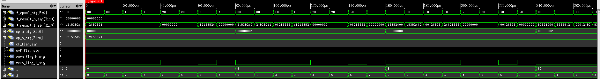

=============================================
Лабораторна робота №4
=============================================

Тема
------

Створення та верифікація АЛП

Хід роботи
-------

**Специфікація** Пристрій повинен виконувати такі операції:
	- Логічний та циклічний зсуви вправо та вліво, арифметичний зсув вправо
	- Додавання та віднімання знакових і беззнакових чисел
	- Множення і ділення цілих чисел
	- Бітові операції AND, NOR, XOR та OR
Також пристрій повинен мати вихідні сигнали overflow та zero.

**Створення проекту** Проект було вирішено створювати на мові Verilog, тому що це зайняло набагато менше часу, ніж створення схеми
у схемному редакторі. Для спрощення роботи над пристроєм мною було вирішено кожну дію виконати в окремому файлі, що дуже сильно спростило
відладку пристрою. Також тут було використано, barrel shifter з попередньої лабораторної роботи, який не потребував відладки, що також трохи спростило створення та відладку пристрою. Потім мною було написано тестовий файл на мові Verilog, що допомогло відладити пристрій.

**Опис пристрою** Мій АЛП має 2 входи данних, та 2 виходи данних(HIGH та LOW), вихід HIGH використовується лише для операцій ділення та множення. Також пристрій має 4 виходи прапорців:
	-> overflow - прапорець переповнення
	-> carry - прапорець переносу
	-> zero_h та zero_l - прапорці нуля(для виходів high та low відповідно)
Операція, яку повинен виконати АЛП задається шістьма бітами адреси, де молодші три біти відповідають за "тип" операції(зсув/логіка...),
а три старші біти задають конкретно операцію, яку ми хочемо, щоб АЛП виконав. Результат всіх операцій, за вийнятком множення і ділення,
розміщується у result_l. А щодо множення і ділення, то:
	-> множення: старші 32 біти результату поміщаються у result_h, а молодші 32 біти - у result_l
	-> ділення: у result_l поміщається результат цілочисельного ділення, а у result_h - залишок від ділення.

Входи та виходи даних мають розрядність 32 біти.

.. image:: media/alu_rtl.png
Так виглядає RTL схема цього АЛП

Так виглядає частина Waveform симуляції

Висновки
-------

В результаті виконання даної лабораторної роботи було розроблено блок АЛП для виконання логічних та арифметичних операцій над цілими числами.
Розроблений пристрій має 2 тридцятидвох розрядні входи даних(під операнди a і b), два тридцятидвох розрядні виходи даних(result_h і result_l),
а також прапорці переносу, переповнення та нуля(2шт.), і шести бітний вхід адреси(завдяки якому обирається операція, яку повинен виконати АЛП).
Також в ході лабораторної роботи мною було здобуто знання зі створення та верифікації арифметично-логічного пристрою.

