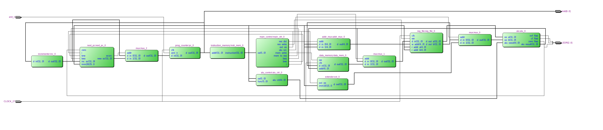
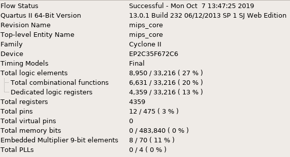

=============================================
Лабораторна робота №5-6
=============================================

Тема
------

Створення та верифікація саморобного RISC ядра

Хід роботи
-------

**Специфікація** 
	Пристрій здатен виконувати наступні інструкції:
	->add			->srl			->xor
	->sub			->ror			->beq
	->mul_h			->sra			->bne
	->mul_l			->rol			->j
	->div			->and			->lw
	->rem			->or			->sw
	->sll			->nor			->slt
Максимальна частота, на якій здатен працювати пристрій 7.22МГц. 

**Створення проекту** 
	Проект було вирішено створювати на мові Verilog, тому що це зайняло набагато менше часу, ніж створення схеми
у схемному редакторі. Для спрощення роботи над пристроєм мною було вирішено кожен блок створити в окремому файлі, що дуже сильно спростило збирання та
відладку пристрою.  Також тут було використано, АЛУ та регістровий файл з попередніх лабораторних робіт, які не потребували відладки, що також трохи 
спростило створення та відладку пристрою. Потім мною було написано тестовий файл на мові Verilog, що допомогло відладити пристрій.

**Опис виконаної роботи** 
	Майже всі вимоги, що були поставлені у завданні - виконано. Було створено таблицю ассемблерних інструкцій та відповідних їм опкодів, адже мій процесор
бінарно не сумісний з оригінальним ассемблером MIPS'а. В процесі верифікації корректності роботи інструкцій, я дійшов висновку, що мати регістр, в якому завжди 
записаний нуль дуже зручно, тому я переробив свій регістровий файл і тепер при читанні з нульвого регістру ми завжди отримуємо нуль. Код зі свого "ассемблеру" 
транслював в машинний код вручну, але на майбутнє планується написання спеціальної програми яка це робитиме, що також дозволить додати ще декілька зручних 
можливостей. За допомогою Quest Timing Analysis визначив максимальну частоту для свого ядра - 7.22МГц.  Прапорці переповнення, нуля та переносу виведені 
на світлодіоди LEDR[2:0], також "шина" на якій знаходиться виконувана ядром інструкція виведена виходом, що дозволяє при потребі показувати, яка зараз інструкція 
виконується завдяк зовнішньому пристрою виводу. 
	Також мною була написана програма на мові ассемблер, яка знаходила добуток максимального на мінімальний елемент массиву, який знаходиться у пам'яті данних, 
куди цей массив було поміщено за допомогою функції $readmemb().

Так виглядає RTL схема цього ядра

Використані ресурси(можна оптимізувати)

Максимальна частота

Висновки
-------

В результаті виконання даної лабораторної роботи було розроблено RISC подібне ядро. Я дізнався багато про те, як влаштовані всередині, та як працюють ядра 
сучасних процесорів. Прибрав "чорну пляму" у своїх знаннях про те, як пов'язуються між собою ассемблерний текст і машинний код та як цей код "заливається" 
у пристрій і як він з цим кодом "співпрацює". Створив свій "ассемблер", та написав на ньому першу "серйозну" програму. Після деяких допрацювань процесор буде 
готовий до "заливки" у плату.

