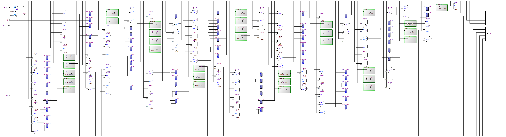
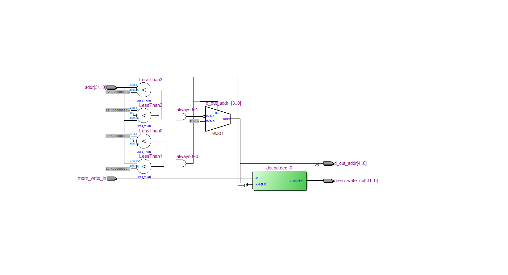

=============================================
Лабораторна робота №7
=============================================

Тема
------

Додавання memory mapped peripherals до ядра (GPIO)

Хід роботи
-------

**Специфікація** 
	GPIO має 32 порти вводу-виводу. Робота з ними виконується за допомогою регістрів DDR(налаштування на вхід чи на вихід), PORT(подання сигналу на вихід),
та PIN(читання сигналу з виходу).

**Створення проекту** 
	Проект було вирішено створювати на мові Verilog, тому що це зайняло набагато менше часу, ніж створення схеми
у схемному редакторі. Для спрощення роботи над пристроєм мною було вирішено кожен блок створити в окремому файлі, що дуже сильно спростило збирання та
відладку пристрою. Потім мною було написано тестовий файл на мові Verilog, що допомогло відладити пристрій.

**Опис виконаної роботи** 
	Я реалізував 32-хбітний модуль GPIO. Цієї кількості виводів має вистачити "на всі випадки життя". Діапазон адрес для GPIO - [128:130]. Також для більш
простого додавання нових модулів у простір пам'яті я додав новий модуль Data_control, який комутує сигнал write enable до потрібного модуля, а також він
вказує з якого модуля будуть подаватися данні на "вихід" простору пам'яті. На своєму "ассемблері" написав програму, яка реалізує програмну ШІМ, а також
виводить на семисегментні індикатори поточне значення коефіцієнту заповненя від 0 до 255, що відповідає реальному коеф. заповнення від 0 до 1. У тестбенчі
показано, як змінюється ширина імпульсів, в залежності від поданого на вхід коду.

Так виглядає RTL схема GPIO модуля

Так виглядає RTL схема модуля Data control

Висновки
-------

В результаті виконання даної лабораторної роботи я навчився створювати та конектити до ядра модуль портів вводу-виводу, а також навчився працювати з
двонаправленими виводами і буферами з третім станом, і написав программу яка одночасно реалізує дешифратор семисегментного індикатора та ШІМ-контроллер.

