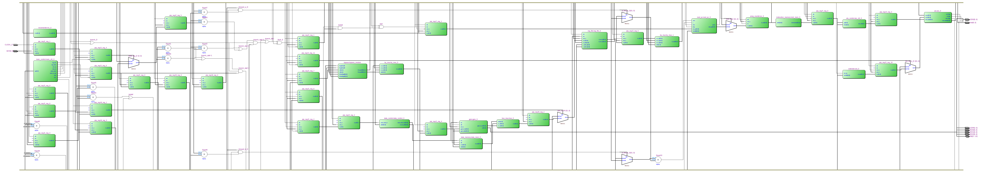
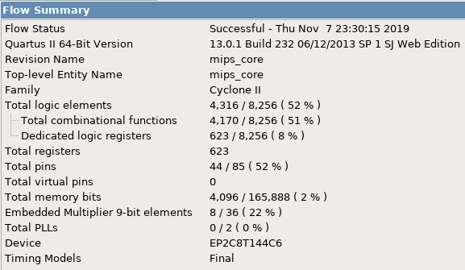

=============================================
Лабораторна робота №8
=============================================

Тема
------

Конвеєризація саморобного RISC ядра

Хід роботи
-------

**Завдання** 
	Конвеєризувати своє ядро, відладити його і навчитися боротися з хазардами.

**Створення проекту** 
	Проект було вирішено створювати на мові Verilog, тому що це зайняло набагато менше часу, ніж створення схеми
у схемному редакторі. Для спрощення роботи над пристроєм мною було вирішено кожен блок створити в окремому файлі, що дуже сильно спростило збирання та
відладку пристрою. Потім мною було написано тестовий файл на мові Verilog, що допомогло відладити пристрій.

**Опис виконаної роботи** 
	Мною було конвеєризовано моє саморобне RISC подібне ядро. Конвеєр має 5 стадій. Для боротьби з data hazards я використовую пересилання данних з інших
стадій через байпас і заповнення конвеєра бульбашками. Відладив ядро за допомогою симулятора Incisive. Потім я скомпілював вихідний код мого ядра у Квартусі
і визначив максимальну частоту, вона виявилася 8.04МГц, проти 6.75МГЦ(якщо не помиляюсь). Тож конвеєризація допомогла підвищити швидкодію процессора. Для тестів
я використовував код, який був написаний на 5-6 лабораторній роботі, а потім для закріплення результатів також код з 7 лабораторної роботи, все працює як треба.

Так виглядає RTL схема GPIO модуля

Використані ресурси(можна оптимізувати)

Максимальна частота

Висновки
-------

	В результаті виконання даної лабораторної роботи я навчився конвеєризовувати RISC подібне ядро. Дізнався про те, які бувають хазарди і як з ними боротися. 
Під час написання вихідного коду ядра, я використовував принцип модульності, що підвищило читабельність коду та спростило відладку. В цілому конвеєризувати ядро
було непросто, але результат того був вартий.

