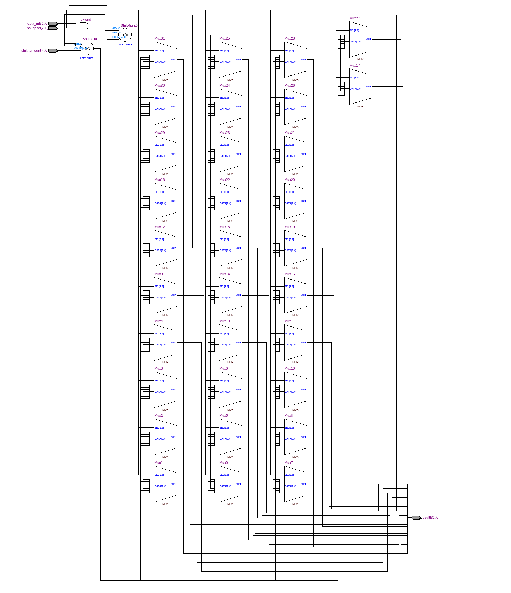
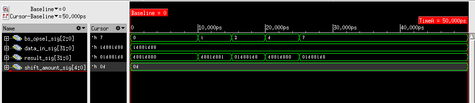

=============================================
Лабораторна робота №3
=============================================

Тема
------
Створення схеми "Barrel Shifter"

Специфікація
-------
  * SLL (shift left logical)
  * SRL (shift right logical)
  * ROL (rotate left)
  * ROR (rotate right)
  * SRA (shift right arithmetical)

Хід роботи
-------
**Створення проекту** Данний проект реалізовано за допомогою мови Verilog та описано у середовищі Quartus 13.1.
По ходу виконання було вирішено використовувати конструкцію casez, а не case або casex. По-перше, на рішення цього вплинули поради викладача, а
по-друге, методом тику було протестовано усі 3 конструкції, та лише з casez программа працювала коректно.
Написано простий та доволі точний тест для симуляції файлу у Cadence Incisive 15.20. 

RTL - схема Barrel Shifter

Симуляції Waveform, виконані у Cadence Incisive 15.20.

Висновки
-------

При виконанні данної лабораторної роботи я стикнувся з проблемою створення латчів у схемі при описанні схеми використовуючи case,
вирішено цю проблему за допомогою конструкції casez, було досягнуто усіх поставлених викладачем цілей, а саме: 
створено схему з арифметичним зсувом праворуч, логічними зсувами ліворуч та праворуч та циклічними зсувами ліворуч та праворуч.
Здобуто знання з використання пристрою швидкого зсуву, та по ходу роботи вивчено нові конструкції casez та casex мови Verilog.
Усі запозичення вказані, конфлікту ліцензій немає.
