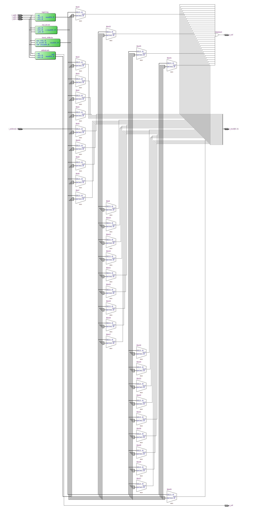
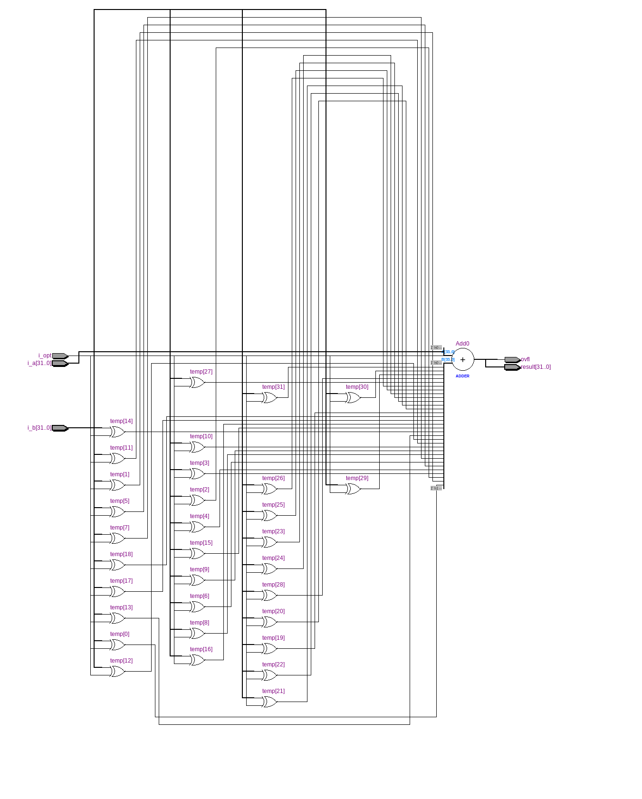
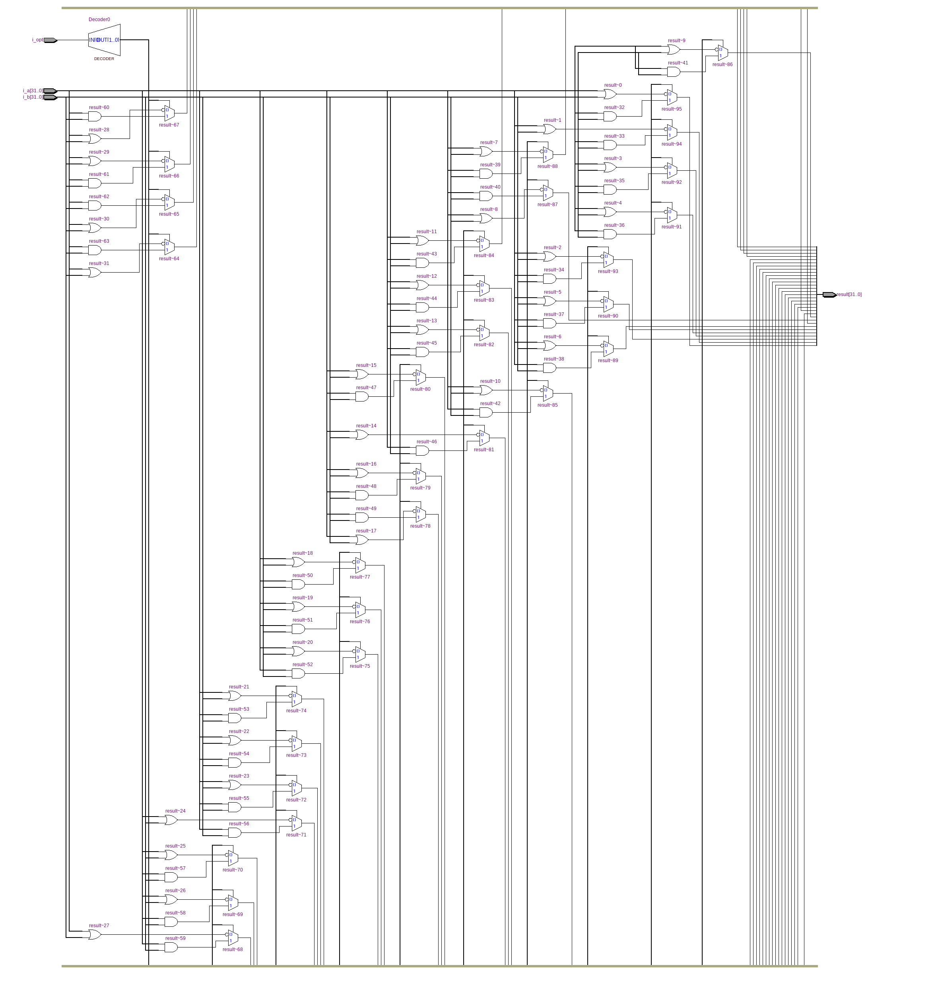
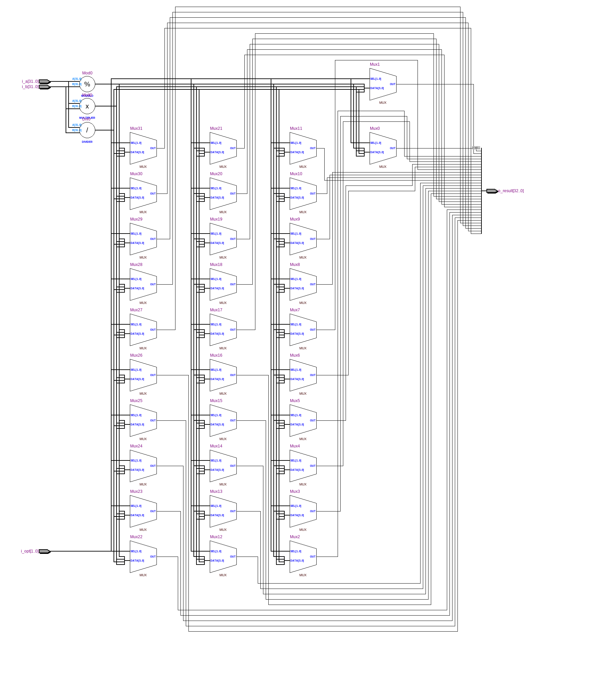
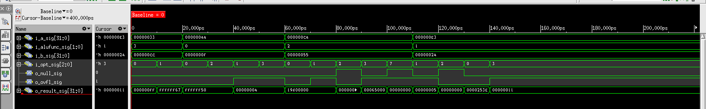

=============================================
Лабораторна робота №4
=============================================

Тема
------

Створення ALU

Специфікація
-------

  * Побітові операції
  * Операції зсуву
  * Додавання знакове та беззнакове 
  * Цілочисленне множення та ділення
  * Вихідні сигнали overflow та zero

Хід роботи
-------

**Створення проекту** Данний проект реалізовано за допомогою мови Verilog та описано у середовищі Quartus 13.1.
Створено модулі проекту, які виконували додавання та віднімання чисел, множення та ділення цілих чисел, 
побітові операції(and, xor, or, nor), операції зсуву(SLL, SRL, ROL, ROR, SRA). За основу операцій зсуву
було взято файл barrel_shifter з 3 лабораторної роботи.

RTL Схема ALU

.. image:: media/barrel_shifter.png
RTL Схема Barrel_Shifter

RTL Схема блоку додавання/віднімання

RTL Схема блоку логічного блоку

RTL Схема блоку множення/ділення

waveform симуляції

Висновки
-------

В ході данної лабораторної роботи було створено модулі до файлу арифметично-логічного приладу(ALU),
який знадобиться у подальших лабораторних роботах для створення власного ядра. Виникли деякі проблеми
в розрядності для сигналу операцій(i_opt), у деяких модулях він різнився(2 да 3 розрядний). При симулюванні
проекту у Cadence Incisive 15.20. отримано та перевірено waveform ALU у правильності роботи. 
У проекті маємо 2 входи "прапорців" з нулем та переповненням, нуль взводиться в лог. 1 при нулі на виході,
а переповнення лише при додаванні та відніманні чисел.
