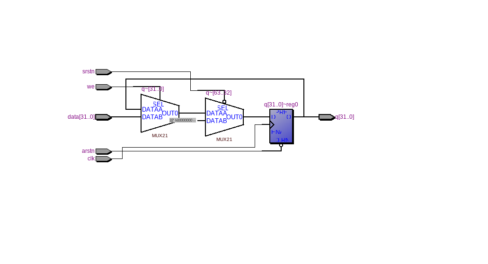
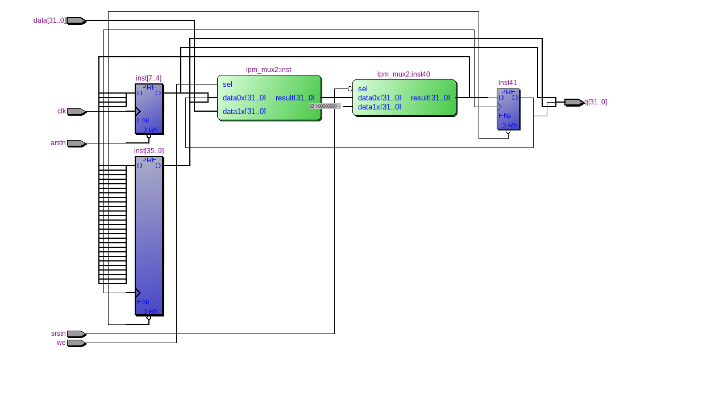

=============================================
Лабораторна робота №1
=============================================

Тема
------

Налаштування середовища розробки (Linux, Quartus, Incisive), тестовий проект

Хід роботи
-------

**Налаштування середовища.** Для виконання завдання лабораторної роботи № 1 було необхідно встановити Manjaro на віртуальну машину. 
Після цього було проведено ряд оновлень та налаштувань для коректної роботи Virtual Box та Manjaro.
Наступним кроком було встановлення всього необхідного софта, серед якого був Quartus 13 SP1 та Cadence Incisive 15.10.

**Створення тестового проекту.** Я повторив проект з відео у тестовій директорії, потім приступив до виконання основного завдання. Завданням
було створити 32-розрядний регістр з асинхронним, синхронним скиданнями та входом дозволу у форматі ``bdf``. Я створив такий проект, використавши
мультиплексори з бібліотеки мегафункцій та сконфігурувавши його через MegaWizard. Після синтезу проекту я експортував його у Verilog файл
та написав простий Testbench, що тестував можливості запису у регістр, його синхронного та асинхронного скидання. Після цього я відкрив директорію
проекту у ``nclaunch``, скомпілював потрібні Verilog файли, виконав elaborate інстансу ``test`` та запустив ``work.test:module`` на симуляцію.
На виході симуляції після кількох невдалих спроб і корекції помилок, з дружньою допомогою Матюші Олега, отримав поведінку, що відповідала очікуванням.

Після цього я написав реалізацію цього самого регістра на Verilog, що було набагато компактніше і зайняло набагато менше часу. 
Ця реалізація запрацювала з тим самим тестбенчем відразу і без помилок.

Так виглядає RTL схема цього регістра, написаного на Verilog

Так виглядає RTL схема, реалізована у схемному редакторі з використанням мегафункції мультиплексора.

За функціональністю ці схеми не відрізняються.

Висновки
-------

На основі проведеної роботи та виконаних завдань можна зробити наступні висновки: створення відносно не дуже складних схем за допомогою схемного редактора 
перетворюється в дуже складну задачу, що може приводити до великої кількості складно відловлюваних помилок або багів.
Verilog завдяки простоті, модульності та компактності дуже добре підходить для таких задач як в плані розробки, так і в плані верифікації, тому краще використовувати саме його.

