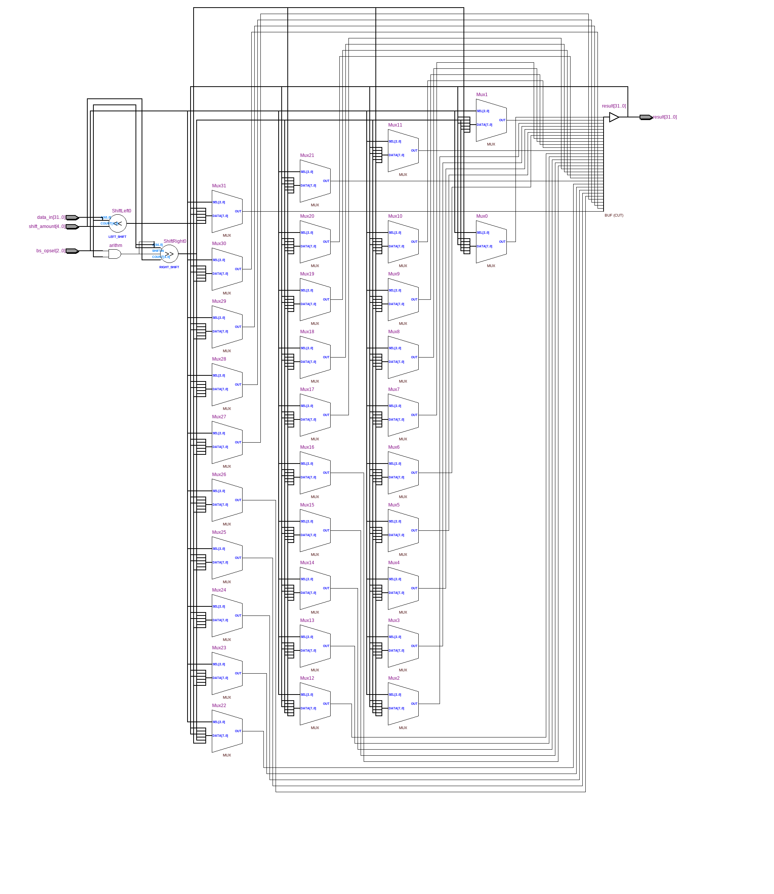
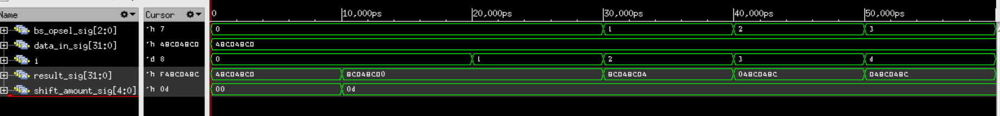

=============================================
Лабораторна робота №3
=============================================

Тема
------
Створення схеми "Barrel Shifter"

Специфікація
-------
  * SLL (shift left logical)
  * SRL (shift right logical)
  * ROL (rotate left)
  * ROR (rotate right)
  * SRA (shift right arithmetical)

Створення проекту
-------
При виконанні даної лабораторної роботи було вирішено будувати проект на  Verilog, так як в при графічному проектуванні було б затрачено надто багато часу.
Тому самим оптимальним було зробити на Verilog, хоча й довелось довго розбиратися з даним методом. В початковому варіанті для реалізації вибору типу зсуву,
використовувалась конструкція case. Та після отриманих викладачем рекомендацій було вирішено використовувати конструкцію casez, так як casez використовує 
функцію don't care, що в свою чергу вплинуло на позитивну роботу коду.Для перевірки було написано простий тест, який послідновно змінював виконува зсув
різни видів на заданому сигналі входу. 
Створений пристрій було протестовано спільно з колегою Харчуком Вадимом, так як ідеї для реалізації черпали з дискусії з викладачем,
проблем при тестуванні не виявлено.

RTL Схема Barrel Shifter 

waveform симуляції

Висновки
-------

В результаті виконання лабораторної роботи було завершено роботу над пристроєм швидкого зсуву.Якщо вірити тестам отримано результати,
які відповідають вірним. Вивчено нову конструкцію мови Verilog - casez, та елемент $signed та принцип роботи barrel shifter.
Хотілось би також відмітити, що даний звіт був побудований на основі звіту Харчука Вадима.
