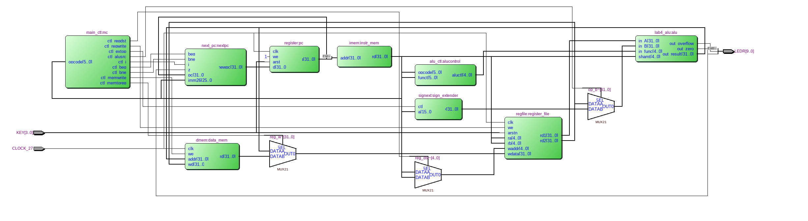
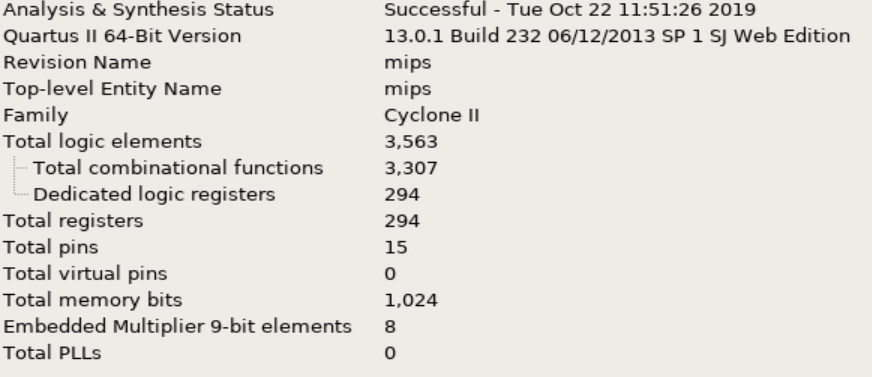
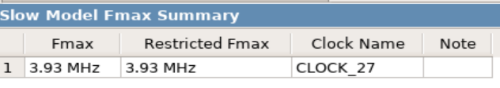

=============================================
Лабораторна робота №5 та №6
=============================================

Тема
----------

Створення та верифікація саморобного RISC ядра.

Хід роботи
----------

**Специфікація.** Специфікація була визначена явно у завданні.
* Зібрати однотактне MIPS подібне ядро, що підтримує наступні інструкції
``add, sub, slt, sgt (with flags affect), mul.hi, mul.lo, div, rem, and, or, nor, xor, lsl, lsr, asr, ror``,
всі вищезазначені інструкції з суфіксом i(i-типу), ``jmp, jz/jnz, jc/jnc, jo/jno, jn/jnn``.
* написати тест, що тестуватиме кожну інструкцію
* написати на асемблері код та перетворити його на текстовий файл з двійковими інструкціями
* перевірити на працездатність

**Створення проекту.** Проект було вирішено створювати на мові Verilog, тому що це зайняло набагато менше часу, ніж створення схеми
у схемному редакторі. Для спрощення роботи над пристроєм мною було вирішено кожен блок створити в окремому файлі, що дуже сильно спростило збирання та
відладку пристрою.  Також тут було використано, АЛУ та регістровий файл з попередніх лабораторних робіт, які не потребували відладки, що також трохи 
спростило створення та відладку пристрою. Потім мною було написано тестовий файл на мові Verilog, що допомогло відладити пристрій.

**Опис виконаної роботи** 
	Майже всі вимоги, що були поставлені у завданні - виконано. Мій створений процесор є майже сумісний з оригінальним Mips. Виключенням є те, що
інструкціїї множення та ділення є замінені. А саме інструкція mull відповідає інструкції addu, а mulh відповідає subu. Ці особливості були враховані при
написанні програми на ассемблері. Варто відмітити, що для компіляції коду на ассемблер потрібно завантажити пакет "cross mips binutils". Щоб скомпілювати 
проект, необхідно в терміналі, відкритому з папки "fw" виконати команду "sh make.sh". Після компіляції ми отримуємо машинний код в 16-ій ситстестемі числення 
у текстовому файлі. Даний вид реалізації був запропонований Матюшею Олегом.
За допомогою Quest Timing Analysis визначив максимальну частоту для свого ядра - 3.93МГц. Прапорці переповнення та нуля 
на світлодіоди LEDR[1:0]. Також мною була написана програма на мові ассемблер, яка знаходила добуток максимального на мінімальний елемент массиву, 
який знаходиться у пам'яті данних, куди цей массив було поміщено за допомогою функції $readmemh().
 

Так виглядає RTL схема mips, написаного на SystemVerilog.

Так виглядають ресурси використані у цьому ядрі.

Так виглядає максимальна частота в даному ядрі.

Висновки
-----------

Під час виконання лабораторної роботи я створив MIPS подібне ядро відповідно до специфікації, навчився працювати з TimeQuest та 
використовувати шаблони при описі цифрових пристроїв, а також написав код на асемблер. Однотактний процесор готовий до заливки у плату. 
Варто відмітити, що виконання даної лабораторної роботи було реалізоване на основі матеріалів та з допомогою Матюши Олега.
