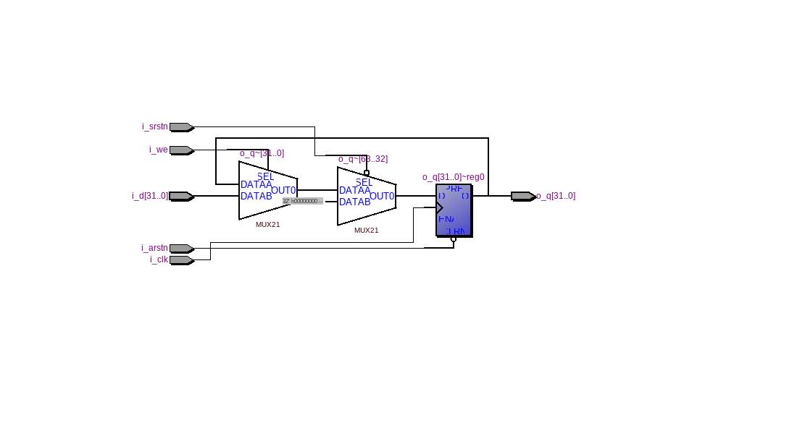

=============================================
Лабораторна робота №1
=============================================

Тема
------

Налаштування середовища розробки (Linux, Quartus, Incisive), тестовий проект

Хід роботи
-------

**Налаштування середовища**Для виконання лабораторної роботи №1 потребувалося встановити операційну систему Manjaro за для економії часу операційна система була встановлена 
на віртуальну машину . програмою віртуалізації була обрана Virtual Box. Після установки та налаштувань операційної системи було встановлене
наступне програмне забезпечення : Cadence Incisive 15.10 та Quartus 13 SP1.

**Створення тестового проекту** Я повторив проект з відео у тестовій директорії, потім приступив до виконання основного завдання. Завданням
було створити 32-розрядний регістр з асинхронним, синхронним скиданнями та входом дозволу у форматі ``bdf``.  
 В проекті були викорисиати мультиплексори з бібліотеки мегафункцій та сконфігурував його через MegaWizard. Після синтезу проекту я створив Verilog опис файлу
та написав простий Testbench, що тестував можливості запису у регістр, його синхронного та асинхронного скидання. Після цього я відкрив директорію
проекту у ``nclaunch``, скомпілював потрібні Verilog файли, виконав elaborate інстансу ``test`` та запустив ``work.test:module`` на симуляцію.
Отримав поведінку, що відповідала очікуванням.

..
     схему синхронног зкидання мені допоміг зробити Матюша Олег. 

Після цього я написав реалізацію цього самого регістра на Verilog, що було набагато компактніше і зайняло набагато менше часу. 
Ця реалізація запрацювала з тим самим тестбенчем відразу і без помилок.

Так виглядає RTL схема цього регістра, написаного на Verilog

.. image:: media/LAB1.xcf
Так виглядає RTL схема, реалізована у схемному редакторі з використанням мегафункції мультиплексора.

За функціональністю ці схеми не відрізняються.

Висновки
-------

на основі виконаних завдань можна з впевненістью сказати що виконання завдань в графічному конструкторі схем Quartus досить зручне але у випадку створення схем з великою 
кількістью однакових елементів краще використовувати мову проектування Verilog в такому випадку код буде мати той самий зміст що і схема ,але  створення Verilog файлу є на багато зручнішим та швидшим.
тому на мою думку комбінувати схематику та код Є оптимальним варіантом для виконання лабораторних робіт.  

..
	за основу був взятий протокол Волинко Назара.

