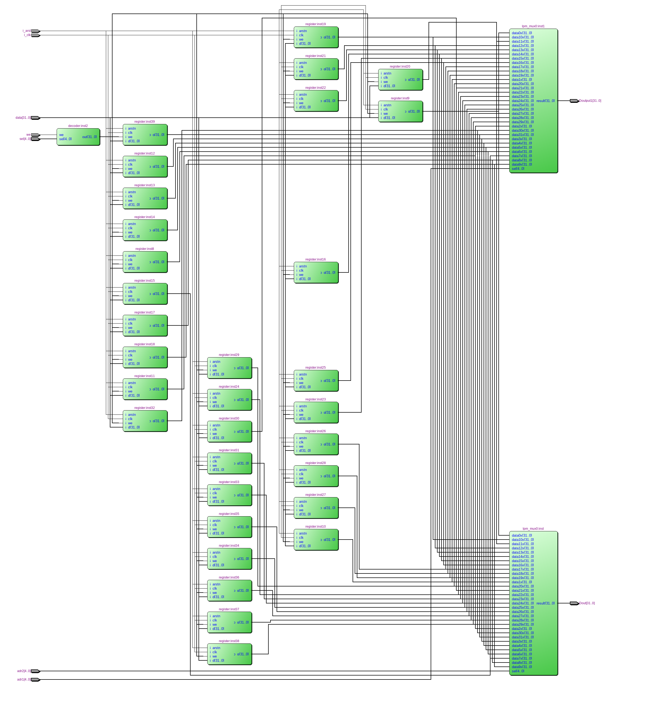
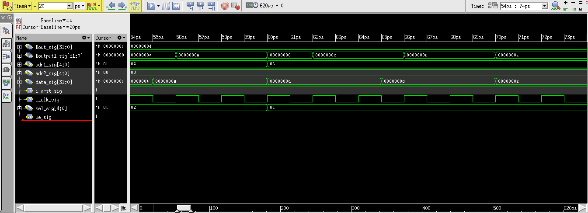

=============================================
Лабораторна робота №2
=============================================

Тема
------

Створення та верифікація регістрового файлу ядра MIPS

Хід роботи
-------

**Створення проекту.** У лабораторній роботі були використані регістри які були створені у попередній лабораторній роботі. За допомогою декодера вибирається адресса 
регістру в який буде записуватись інформація. Так як сигнал Data  подається одночасно на всі входи регістрів то запис буде відбуватись лише в той регістер на який подається  we . Зчитування відбувається за допомогою двох мультиплексорів за досить схожим 
принципом. На вхід Adr млуьтиплексора подається адресса регістру з якого відбудеться зчитування і мультиплексор приймає вихідний сигнал з відповідного регістра.
   
Тобто фактично основна схема була розроблена графічним методом, але сам регістр та декодер були написані на Verilog.

.. image:: media/Block2.bmp
Так виглядає схема регістрового файлу, реалізована у Quartus

Так виглядає RTL схема цього регістрового файлу

Так виглядає частина Waveform симуляції. 

Висновки
-------

Під час виконання лабораторної роботи я створив регістровий файл з32 регістрів по 32 біта з асиннхронним скиданням створена схема успішно пройшла симуляцію та виконувала поставлену задачу запису та зчитування інформації. 
А також здобув деякі знання мови Verilog. Побудував декодер на мові Verilog. Навчився розбивати створювані реалізації на модулі та параметризувати їх.

.. 
	даний звіт до лабораторної роботи був побудований на основі звіту Шліхти Олександра та Назара Волинко.

