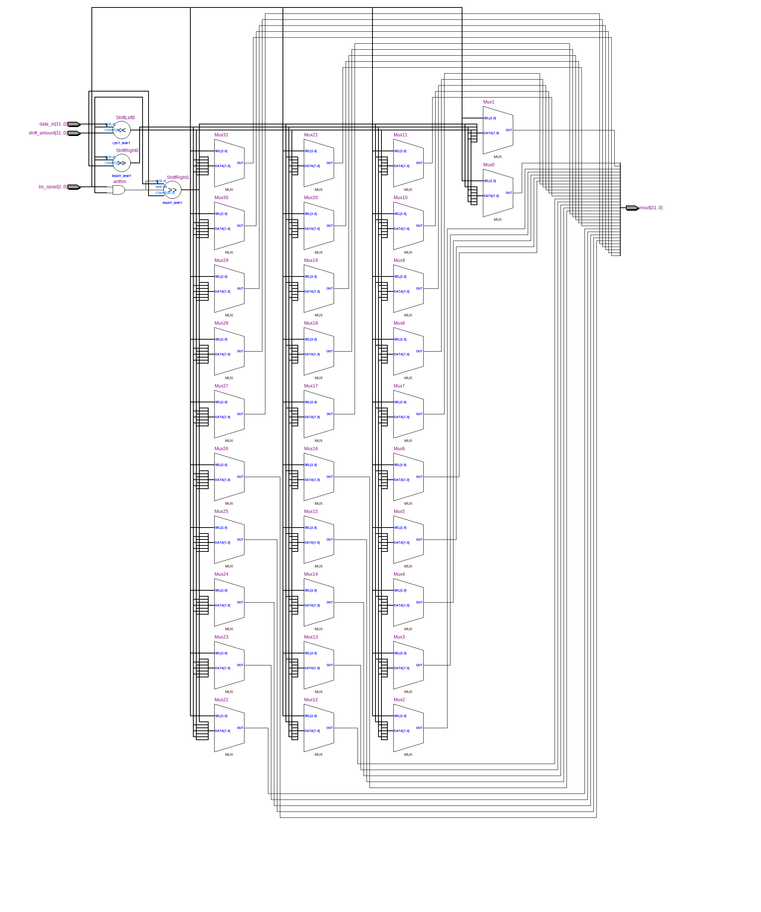
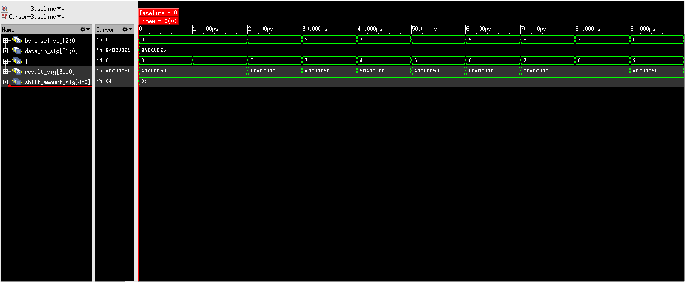

=============================================
Лабораторна робота №3
=============================================

Тема
------

Створення схеми "barrel shifter"

Хід роботи
-------

**Створення проекту.** у даній лабораторній роботі була реалізована схема "barrel shifter". Дана схема може виконувати 3 типи ззвигу в дві сторони (за вийнятком арефметичного зсуву) на різну кількість бітів.
Під час виконання роботи виникали проблеми повязані з генерацією latch елементів але на счастья проблема була вирішена.latch елементи генерувались через присутність великої кількості (if else) блоків.
 Проблема була вирішена наступним чином, на заміну блокам (if else) було поставлено блок (casez).Після даних змін latch елементи пеоестали утворюватись і схема почала адекватно виглядати в  "RTL viewer".
далі був створений test bench файл для перевірки дієздатності схеми. Для перевірки можливості взаємо заміни test bench файлів, протестував роботу test bench файлу Волинко Назара на своїй рналізації схеми    

Так виглядає RTL схема схеми "barrel shifter"

Так виглядає частина Waveform симуляції. як видно з ілюстрації і схема ,і test bench файл працює як потрібно.

Висновки
-------

Під час виконання лабораторної роботи я вперше майже самостійно реалізував робочу схему на мові опису логічгих схем Verilog. Найбільшою проблемою підчас виконання лабораторної роботи
 стало реалізація вибору здвигу за допомогою елемнта & . Створена схема коректно виконувала поставлені задчі та відповідає ткхнічному завданню.
Тому мету лабораторної роботи можна вважати досягнутою  

