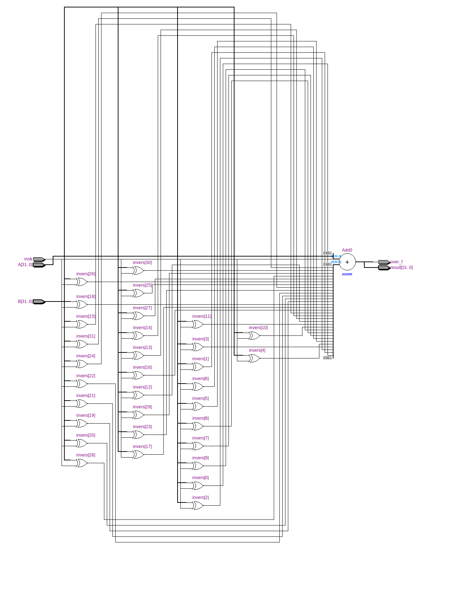
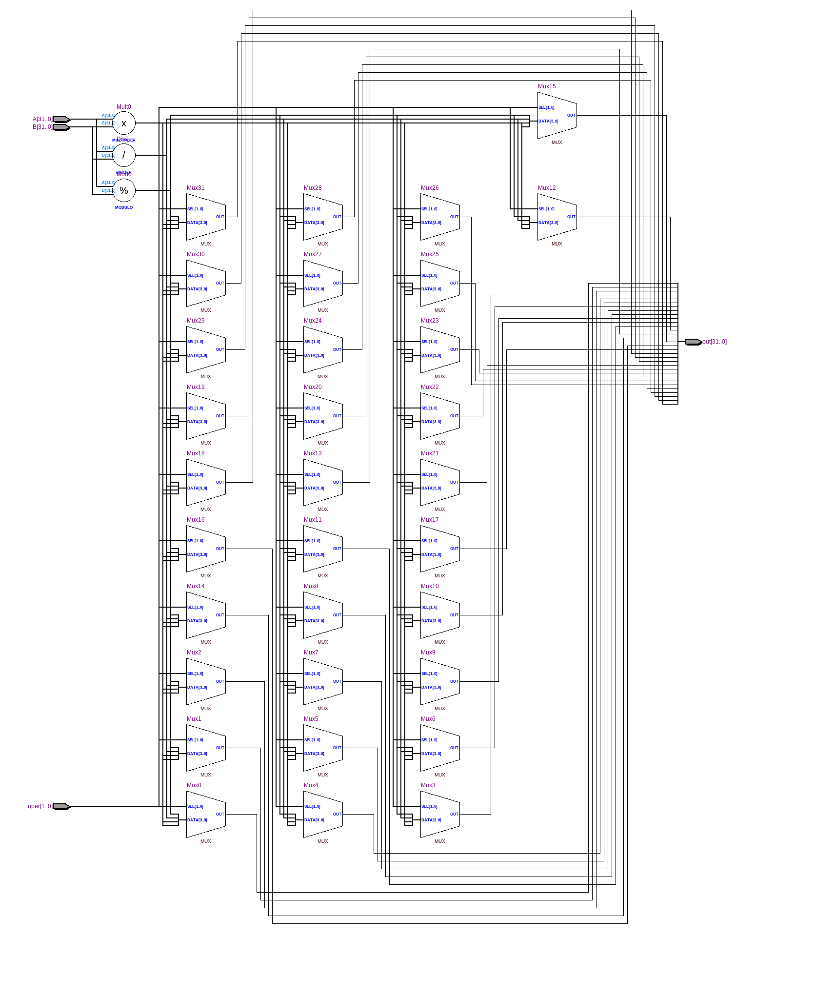
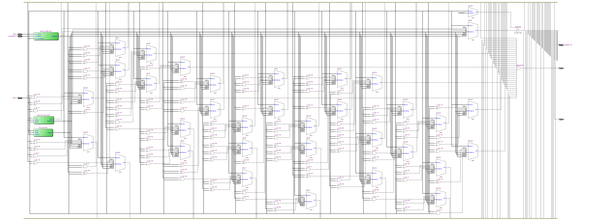

=============================================
Лабораторна робота №4
=============================================

Тема
------

Створення та верифікація АЛП

Хід роботи
-------

**Специфікація** Пристрій повинен виконувати такі операції:
	- Логічний та циклічний зсуви вправо та вліво, арифметичний зсув вправо
	- Додавання та віднімання знакових і беззнакових чисел
	- Множення і ділення цілих чисел
	- Бітові операції AND, NOR, XOR та OR
Також пристрій повинен мати вихідні сигнали overflow та zero.

**Створення проекту** Проект було створено на мові проектування цифрових схем цей вибір був зумовлений тим що створення даного проекту в схематиці є незручним 
а також дуже часозатратним підчас виконання лабораторної роботи було створено декілька модулів а саме модуль самого ALU модуль в якому було реалізоване 
множення та ділення і модуль додавання та віднімання.

**Опис пристрою** створений мною АЛП має один вихід данних. та 2 бітових вихода під прапорці 
-> overflow - прапорець переповнення потрібен лише при операціях додавання та віднімання
-> zero - прапорець нуля на виході він приймає своє значення в залежності від числа на виході з АЛП якщо число = 0 мо прапорець приймає значення 1.
Операція, яку повинен виконати АЛП задається вісьмома бітами адреси, де старші 5 бітів відповідають за тип оаерації а молодші 3 передають в модуль утчнену інформацію 
яку саме операцію потрібно виконати 
Результат всіх операцій розміщується у result. 
При операціях множення 2х 32х бітних чисел результат виходить 64 бітним числом(LOW та HIGH частина). в результаті за бажанням можна вивести або LOW або HIGH
на вихід модуля вибір .При діленні відповідно маємо результат та остачу ділення як і з множенням навихід можемо подати або або рнзультат ділення або остачу від ділення.  
Входи та вихід даних мають розрядність 32 біти. Як зазначалось раніше, проект складається з декількох модулів. Розглянемо RTL схеми деяких
з цих модулів.

Так виглядає RTL схема модуля суматора-віднімача.

Так виглядає RTL схема модуля для множення та ділення.

Так виглядає RTL схема головного модуля АПЛ(логічних операцій).

.. image:: media/lab4_1.png

.. image:: media/lab4_2.png
Так виглядає Waveform симуляція

Висновки
-------

В результаті виконання даної лабораторної роботи було розроблено блок АЛП для виконання логічних та арифметичних операцій над цілими числами.
Підчас виконання роботи а саме підчас синтезу схеми були деякі проблеми а саме була велика кількість попереджень які вказували на присутність
лишньої логіки. після детального дослідження питання оптимальності описаної логіки було оптимізовано код в наслідок чого ці попередження зникли.
Поставлену задачу можна вважати виконаною так-як всі модулі АЛП працюють так як повинні працювати.

..

	деякі моменти та загалом осноава протоколу була зроблена за порадами Волинко Назара та Шліхти Олександра. 
