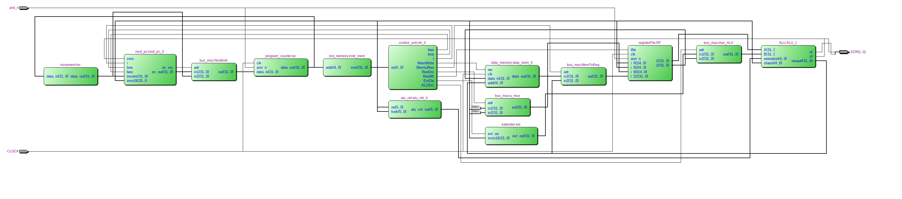
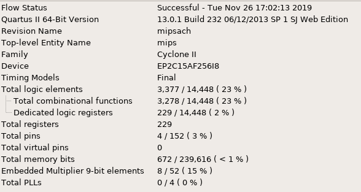
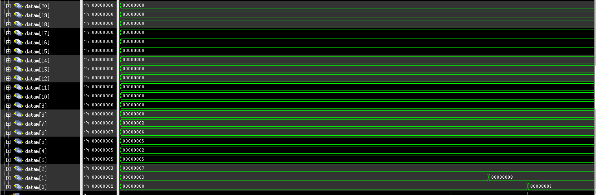
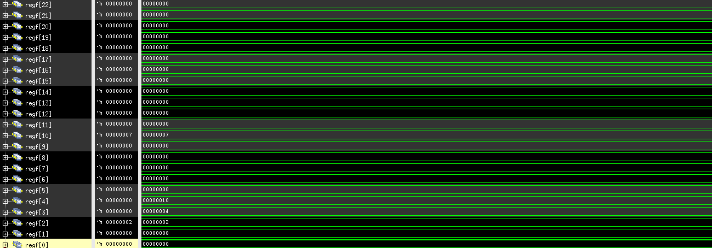

=============================================
Лабораторна робота №5 та №6
=============================================

Тема
----------

Створення MIPS подібного RISC ядра.

Хід роботи
----------

**Специфікація.** 

Специфікація була визначена явно у завданні.
* Зібрати однотактне MIPS подібне ядро, що підтримує наступні інструкції
``add, sub, slt, mul.hi, mul.lo, div, and, or, nor, xor, lsl, lsr, asr, ror, beq , bne , jump , lw , sw``,
всі вищезазначені інструкції з суфіксом i(i-типу) за виключенням наступних ``jump , lw , sw``.
* написати на асемблері програму та перетворити його на текстовий файл з двійковими інструкціями

**Створення проекту.** 

Данний проект було створено на мові опису логіки цифрових схем Verilog , по тій причині що створерння даного проекту в схематиці є досить складним процесом,що потребує багато терпіння та часу, тим більше що описуючи логіку цього проекту на Verilog я здобув багато досвіду. Такі модулі як  АЛУ та регістровий вайл 
були взяті з попередніх лабораторних робот з деякими допрацюваннями. Хотілося б додати що програма для підтвердження праценздатності ядра написана в машинному
коді а опис програми в коді асемблера було додано в виді коментарів до машинного коду.       

**Опис виконаної роботи** 

Майже всі вимоги, що були поставлені у завданні - виконано! А саме всі інструкції які повинні виконуватись ядром виконуються. Основна відмінність 
створеного MIPS подібного ядра від оригіналу це перероблений program counter а саме було прибрано кратність адреси 4. В модуль АЛП було додоно окремий вхід даних
для кількості здвигів ,а також в АЛП було реалізовано інструкцію "slt". В модулі регістрового файлу було створено нульовий регістр в якому завжди зберігається нуль. 
Всі інші модулі були створені з нуля. Після створення самого ядра було написано програму для перевірки працездатності  процесора , прогама виконує сортування масиву довільного 
розміру за алгоритмом "бульбашка" а також ділить та множить мвксимальне значення в масиві на мінімальне. Також на додаток хотілось би відмітити що організація instruction memory
,що по своїй суті являє собою ROM пам'ять, було реалізовано за допомогою функції $readmemh() ця функція також була використана в модулі data memory це було зроблено для 
прискорення введеня початкових данних в нашому випадку масиву. За допомогою Quest Timing Analysis визначили максимальну частоту для свого ядра - 2.85МГц. Прапорці переповнення та нуля
виведені на світлодіоди LEDR[1:0]. 

Так виглядає RTL схема mips, написаного на SystemVerilog.

Так виглядають ресурси використані у цьому ядрі.

Так виглядає максимальна частота в даному ядрі.

Вигляд масиву данних для сортування в регістрі data memory

.. image:: media/data_out.png
Результат сортуваннямасиву данних

Кінцеві значення регістру , перевірка виконання множення та ділення

Висновки
-----------

Під час виконання лабораторної роботи я створив MIPS подібне ядро яке працює відплвідно до поставленого завдання. Під час створення ядра робив велику кількість недолугих
помилок через які витратив багато часу на налагодження ядра але завдяки цьому повністью розібрався в принципі робоботи однотактного MIPS ядра та здобув чималу кількість знань.
Також було написано алгоритм сортування бульбашкою на асемблері та в ручну переведено в машинний код. Однотактний процесор готовий до завантаження у плату. 
Варто відмітити, що при виконанні даної лабораторної роботи отдимав багато корисних порад від Матюши Олега.

